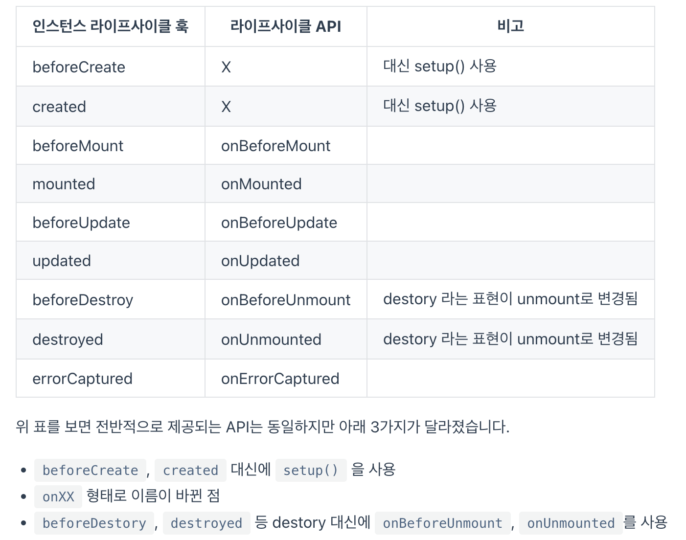

# study-vue3

### 코드 작성 방법
- `Option API` : 새롭게 배워 나갈 경우, Option을 추천.
    ```javascript
    import { createApp } from 'vue'

    createApp({
    data() {
        return {
        count: 0
        }
    }
    }).mount('#app')
    ```

- `Composition API`
    ```javascript
    import { createApp, ref } from 'vue'

    createApp({
    setup() {
        return {
        count: ref(0)
        }
    }
    }).mount('#app')
    ```

### 개발 환경 구성
- [Node.js](https://nodejs.org/en/) : LTS 버전을 선택하는 것이 좋다.
- [Cmder](https://cmder.app/)
- [수업 자료가 들어있는 깃헙 리포지토리 주소](https://github.com/joshua1988/learn-vue-js)
- [Vue.js 개발자 도구](https://chromewebstore.google.com/detail/vuejs-devtools/nhdogjmejiglipccpnnnanhbledajbpd?pli=1)
- VSCode 확장 플러그인 목록
    - Vue 3 : [Volar](https://marketplace.visualstudio.com/items?itemName=Vue.volar)
    - 색 테마 : [Night Owl](https://marketplace.visualstudio.com/items?itemName=sdras.night-owl)
    - 파일 아이콘 테마 : [Material Icon Theme](https://marketplace.visualstudio.com/items?itemName=PKief.material-icon-theme)
    - 뷰 확장 플러그인 : [Vetur](https://marketplace.visualstudio.com/items?itemName=octref.vetur)
    - 뷰 코드 스니펫 : [Vue VSCode Snippets](https://marketplace.visualstudio.com/items?itemName=sdras.vue-vscode-snippets)
        - `vbc`를 치면, vue 기본 템플릿 나열
            ```html
            <template>
                <div>

                </div>
            </template>

            <script>
                export default {
                    
                }
            </script>

            <style scoped>

            </style>
            ```
    - 문법 검사 : [ESLint](https://marketplace.visualstudio.com/items?itemName=dbaeumer.vscode-eslint), TSLint
    - 실습 환경 보조 : Live Server
    - 기타 : Prettier, [Project Manager](https://marketplace.visualstudio.com/items?itemName=alefragnani.project-manager), [Auto Close Tag](https://marketplace.visualstudio.com/items?itemName=formulahendry.auto-close-tag), [GitLens](https://marketplace.visualstudio.com/items?itemName=eamodio.gitlens), [Atom Keymap](https://marketplace.visualstudio.com/items?itemName=ms-vscode.atom-keybindings), [Jetbrains IDE Keymap](https://marketplace.visualstudio.com/items?itemName=isudox.vscode-jetbrains-keybindings) 등

### Vue.js 개발자 도구 안내
- [개발자 도구 설치 링크](https://chromewebstore.google.com/detail/vuejs-devtools/nhdogjmejiglipccpnnnanhbledajbpd)

### 강의 교안과 소스 코드 안내
- [강의 교안(Cracking Vue.js)](https://joshua1988.github.io/vue-camp/)
- [강의 깃헙 리포지토리](https://github.com/joshua1988/learn-vue-js)

### vue 약어
- `v-bind:` : `:`
- `v-on:click=` : `@click=`
- `preventDefault` : 버튼에서 기본적인 이벤트 제외할 때, `??.prevent:AA`으로 입력
    ```html
    <!-- 예시 -->
    <form action ="" @submit.prevent="submitForm">
    ```

### v-for, v-if
- `v-for`
    ```html
    <ul>
        <li
            v-for="user in activeUsers"
            :key="user.id"
        >
            {{ user.name }}
        </li>
    </ul>
    ```

- `v-if`
    ```html
    <ul>
        <template v-for="user in users" :key="user.id">
            <li v-if="user.isActive">
            {{ user.name }}
            </li>
        </template>
    </ul>
    ```

### vue install
- `vue` 설치 명령어 : `npm i @vue/cli -g`

### vue 프로젝트 폴더 생성
- `vue create 생성할_폴더명`
    - `vue 3`로 설치

### Composable === hooks
- 본 강의에선 `Composable(컴포저블)` 보단 `hooks`로 사용.

### setup에서 컴포넌트 이벤트 발생
-
```javascript
export default {
    setup(props, context) {
        // 방법 1
        context.emit('change')

        // 방법 2 - 데이터를 넘길 때
        context.emit('change', 100)
    }
}
```

### 인스턴스 라이프사이클
- [인스턴스 라이프사이클 - cracking Vue js](https://joshua1988.github.io/vue-camp/vue/life-cycle.html#%E1%84%85%E1%85%A1%E1%84%8B%E1%85%B5%E1%84%91%E1%85%B3%E1%84%89%E1%85%A1%E1%84%8B%E1%85%B5%E1%84%8F%E1%85%B3%E1%86%AF-%E1%84%83%E1%85%A1%E1%84%8B%E1%85%B5%E1%84%8B%E1%85%A5%E1%84%80%E1%85%B3%E1%84%85%E1%85%A2%E1%86%B7)
    ```javascript
    // vue 2
    export default {
        // 인스턴스 옵션 속성 형태로 작성된 라이프사이클 훅
        created() {},
        beforeMount() {},
        mounted() {},
        destroyed() {}
    }
    
    // vue 3
    export default {
        // 인스턴스 옵션 속성 형태로 작성된 라이프사이클 훅
        created() {},
        beforeMount() {},
        mounted() {},
        destroyed() {}
    }
    ```

    <br />
    <br />

    ```javascript
    import { ref, onMounted } from 'vue';

    export default {
        setup() {
            // data
            const message = ref('Hello');

            // lifecycle API
            onMounted(() => {
            console.log(message.value);
            });
        }
    } 
    ```
