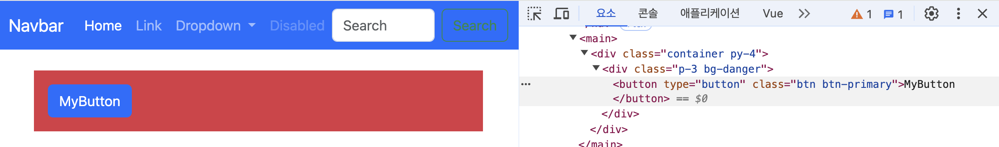
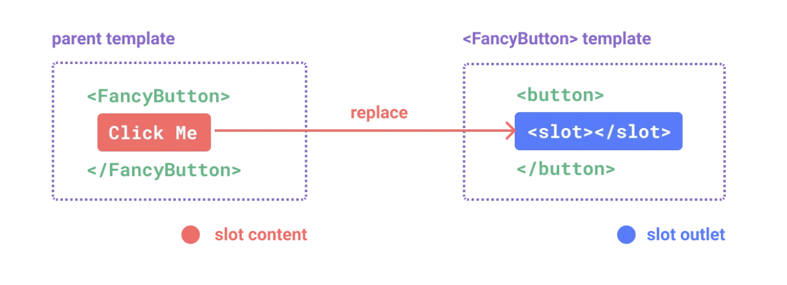
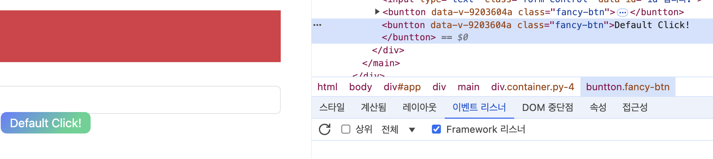
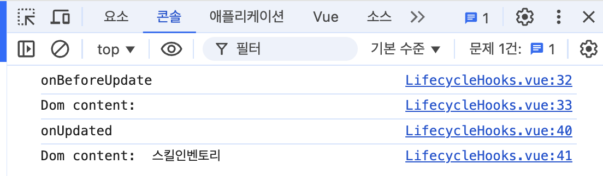

## Vue3 완벽 마스터: 기초부터 실전까지 - "기본편"
- [Vue3 완벽 마스터: 기초부터 실전까지 - "기본편"](https://www.inflearn.com/course/vue-%EC%99%84%EB%B2%BD-%EA%B8%B0%EB%B3%B8/dashboard)
- [수업 교안](https://gymcoding.notion.site/Vue-js-3-cd9bb8ec6fec4ba9b388c808caf61880)

### VSCode 확장 프로그램 설치
- [indent-rainbox](https://marketplace.visualstudio.com/items?itemName=oderwat.indent-rainbow)
    : `tab` 관련 표시 (길어졌을 때 용이)

- [Auto Rename Tag](https://marketplace.visualstudio.com/items?itemName=formulahendry.auto-rename-tag)
    : 한 쪽만 변경해도 다른 한 쪽 동시 변경 가능.

- [CSS Peek](https://marketplace.visualstudio.com/items?itemName=pranaygp.vscode-css-peek)
    : css를 어디에서 선언했는 지 쉽게 확인 가능.

- [HTML to CSS autocompletion](https://marketplace.visualstudio.com/items?itemName=solnurkarim.html-to-css-autocompletion)
    : `html`로 먼저 작성하고 `css` 작성할 때 자동으로 지원.

- [HTML CSS Support](https://marketplace.visualstudio.com/items?itemName=ecmel.vscode-html-css)
    : `css` 선언 후, `html` 작성할 때 자동으로 지원.

- [volar - vue3 통합 === Vue - Official](https://marketplace.visualstudio.com/items?itemName=Vue.volar)
    : [vscode vue3 확장 플러그인 Volar 없을때 해결 방법 (Vue - Official)](https://pingfanzhilu.tistory.com/entry/Visual-Studio-Code-vscode-vue3-%ED%99%95%EC%9E%A5-%ED%94%8C%EB%9F%AC%EA%B7%B8%EC%9D%B8-Volar-%EC%97%86%EC%9D%84%EB%95%8C-%ED%95%B4%EA%B2%B0-%EB%B0%A9%EB%B2%95-Vue-Official)

- [Vue VSCode Snippets](https://marketplace.visualstudio.com/items?itemName=sdras.vue-vscode-snippets)
    : vscode에서 `vue` 자동 완성 기능.

### 프로젝트 구성 시 참고
- `npm init vue@3.1.9`으로 ESLint 버전 맞추기. (실제 강의 내용 버전과 동일)
- `vue` 설치 시, `npm install -g @vue/cli` 보단 `vite` 설치를 권장.
    - `vue cli` : 현재 유지 모드 관리.
    - `vite` : **매우 가볍고 빠른 빌드 도구 (공식 문서에서 권장)**
        - `npm init vue@latest` 설치
            ```javascript
            cd (product name)
            npm install
            npm run dev
            ```
        
        - [Vite Server Port 관련 참고](https://ko.vitejs.dev/config/server-options.html#server-port)
        - [Vite 3.0 출시 Server Port 관련 참고](https://vite.dev/blog/announcing-vite3.html#vite-cli)
        - [질문, npm run dev 했을때 자동 새로고침 문의드립니다](https://www.inflearn.com/community/questions/816512/npm-run-dev-%ED%96%88%EC%9D%84%EB%95%8C-%EC%9E%90%EB%8F%99-%EC%83%88%EB%A1%9C%EA%B3%A0%EC%B9%A8-%EB%AC%B8%EC%9D%98%EB%93%9C%EB%A6%BD%EB%8B%88%EB%8B%A4)
            - `vite.config.js`에 아래 빨간 네모 박스 부분 추가.
                
                ```javascript
                server: {
                    watch: {
                        usePolling: true,
                    }
                }
                ```

### Vue 프로젝트 설치
- [Vue3 공식 문서](https://vuejs.org/guide/quick-start.html)
- `npm create vue@latest`
    ```javascript
    ✔ Project name: … learn-vue3
    ✔ Add TypeScript? … No
    ✔ Add JSX Support? … No
    ✔ Add Vue Router for Single Page Application development? … No
    ✔ Add Pinia for state management? … No
    ✔ Add Vitest for Unit Testing? … No
    ✔ Add an End-to-End Testing Solution? › No
    ✔ Add ESLint for code quality? › Yes
    ✔ Add Prettier for code formatting? … Yes
    ```

- 다만 `npm init vue@3.1.9`로 설치하면, 아래와 같이 보여진다.
    ```javascript
    cd learn-vue3
    npm install
    npm run lint
    npm run dev
    ```

### 새로운 버전에 대한 ESLint, Prettier 
- ESLint Rule을 적용하시려면 `eslint.config.js` 해당 파일에 적용하시면 됩니다.
    ```javascript
    // eslint.config.js
    import js from '@eslint/js'
    import pluginVue from 'eslint-plugin-vue'
    import skipFormatting from '@vue/eslint-config-prettier/skip-formatting'

    export default [
        {
            name: 'app/files-to-lint',
            files: ['**/*.{js,mjs,jsx,vue}'],
        },

        {
            name: 'app/files-to-ignore',
            ignores: ['**/dist/**', '**/dist-ssr/**', '**/coverage/**'],
        },

        js.configs.recommended,
        ...pluginVue.configs['flat/essential'],
        skipFormatting,
        {
            rules: {
            'no-console': 'warn', // console 메서드 사용시 경고(warn) 표시
            },
        },
    ]
    ```
- Prettier 룰을 적용하시려면 `.prettierrc.json` 파일에 적용하시면 됩니다.
    ```javascript
    // .prettierrc.json
    {
        "$schema": "https://json.schemastore.org/prettierrc", // Prettier 설정 스키마
        "semi": false, // 세미콜론 생략
        "singleQuote": true, // 작은따옴표 사용
        "arrowParens": "avoid" // 매개변수 하나일 때 괄호 생략
    }
    ```

- [질문, 강의에서 나오는 .eslintrc.cjs 파일과 현재 제 .eslintrc.cjs 파일의 내용이 다른데요?](https://www.inflearn.com/community/questions/946484/eslintrc-cjs-%EC%84%A4%EC%A0%95%ED%95%98%EB%8A%94%EB%8D%B0-%EA%B0%95%EC%9D%98%ED%95%B4%EC%A3%BC%EC%8B%9C%EB%8A%94-%EC%BD%94%EB%93%9C%EC%99%80-%EC%A0%9C-%EC%BD%94%EB%93%9C%EA%B0%80-%EB%8B%A4%EB%A6%85%EB%8B%88%EB%8B%A4)

### vscode에서 ESLint 기반으로 Format On Save 설정하기
- vscode 설정 : settings.json
    ```javascript
    // 검사해야 하는 언어를 ESLint 확장에 알려줍니다.
    "eslint.validate": [
        "javascript",
        "javascriptreact",
        "typescript",
        "typescriptreact",
        "html",
        "vue",
        "markdown"
    ],
    // vscode의 저장 이벤트에 대한 훅
    "editor.codeActionsOnSave": {
        // 저장 중인 파일의 문제를 수정하라는 메세지
        "source.fixAll.eslint": true,
    }
    ```

### 프로젝트 템플릿 자동 생성
- `vbase-3` 하게 되면 아래와 같이 보여진다.
  ```javascript
  <template>
    <div>

    </div>
  </template>

  <script>
  export default {
    setup () {
      

      return {}
    }
  }
  </script>

  <style lang="scss" scoped>

  </style>
  ```
<hr />

### COMPOSITION API
- **setup() 함수**
  ```javascript
  export default {
    props: {
      title: String,
    },

    // 첫번째 매개변수 => props
    // 두번째 매개변수 => context
    setup(props, context) {
      const counter = ref(0);
      const increment = () => {
        counter.value++;
      };

      console.log(props.title);

      // 속성($attrs와 동일한 비반응형 객체)
      console.log(context.attrs);

      // 슬롯($slots)에 해당하는 비반응성 객체
      console.log(context.slots);

      // 이벤트 발생($emit에 해당하는 함수)
      console.log(context.emit);

      // Public한 속성, 함수를 외부에 노출시에 사용
      console.log(context.expose);

      return { counter, increment };
    },
  };
  ```
  - `context` 경우, 구조 분해 할당을 사용 할 수 있다.
  ```javascript
  export default {
    setup(props, { attrs, slots, emit, expose }) {
      // 속성($attrs와 동일한 비반응형 객체)
      console.log(attrs);

      // 슬롯($slots)에 해당하는 비반응성 객체
      console.log(slots);

      // 이벤트 발생($emit에 해당하는 함수)
      console.log(emit);

      // Public한 속성, 함수를 외부에 노출시에 사용
      console.log(expose);
    }
  }
  ```

- **템플릿 문법**
  - `v-once` : 데이터가 변경되어 갱신(반응)되지 않는 일회성 보간을 수행<br/>
    
    ```html
    <template>
      <div>
        <p>문자열: {{ message }}</p>
        <h3>보간법</h3>
        <!-- v-once : 데이터가 변경되어 갱신(반응)되지 않는 일회성 보간을 수행 -->
        <p v-once>문자열: {{ message }}</p>
        <button @click="btnOnce">변경</button>
      </div>
    </template>

    <script>
    import { ref } from 'vue';

    export default {
      setup() {
        const message = ref('안녕하세요');
        const btnOnce = () => {
          message.value = `${message.value}!`;
        };
        return { message, btnOnce };
      },
    };
    </script>

    <style lang="scss" scoped></style>
    ```

  - `v-html` : html을 그대로 출력 
    - 다만 XSS 취약점으로 쉽게 이어질 수 있어 매우 위험할 소지가 있다.
    - 따라서 신뢰할 수 있는 콘텐츠에서만 사용하고 **사용자가 제공한 콘텐츠에서는 절대 사용 불가**.<br />
    
    ```html
    <template>
      <h3>v-html</h3>
      <!-- v-html: html을 그대로 출력 -->
      <p>{{ rawHtml }}</p>
      <p v-html="rawHtml"></p>
    </template>

    <script>
    import { ref } from 'vue';

    export default {
      setup() {
        const rawHtml = ref('<strong>안녕하세요옹!</strong>');
        return { rawHtml };
      },
    };
    </script>

    <style lang="scss" scoped></style>
    ```

  - `v-bind` : 실무에서 많이 사용 된다. title, disabled 등등<br />
    <br />
    <br />
    - `disabled`을 `true`로 할 경우, 사용 불가 / `false`로 할 경우 사용 가능.<br />
    
    ```html
    <template>
      <h3>속성 바인딩</h3>
      <div title="안녕하세요">마우스를 올려보세요.</div>
      <div v-bind:title="dynamicTitle">여기에 올려보세요오!!</div>
      <input type="text" value="이은혜" v-bind:disabled="isInputDisabled" />
    </template>

    <script>
    import { ref } from 'vue';

    export default {
      setup() {
        const dynamicTitle = ref('다이나믹 타이틀');
        const isInputDisabled = ref(true);
        return { dynamicTitle, isInputDisabled };
      },
    };
    </script>

    <style lang="scss" scoped></style>
    ```

    - **자주 사용되는 `v-bind`는 `:`으로 사용된다.**
    - **앞으로 본 강의에서는 `:`으로 단축 속성을 사용한다.**
    ```html
    <input type="text" value="이은혜" :disabled="isInputDisabled" />
    ```

    - `v-bind`는 다중 속성 적용이 가능하다.<br />
      
    ```html
    <template>
      <input v-bind="attrs" />
    </template>

    <script>
    import { ref } from 'vue';

    export default {
      setup() {
        const attrs = ref({
          type: 'password',
          value: '1234',
          disabled: false,
        });
        return { attrs };
      },
    };
    </script>

    <style lang="scss" scoped></style>
    ```

  - **자바스크립트 표현식 사용 가능**<br />
    
    ```html
    <template>
      <h3>JAVASCRIPT</h3>
      {{ message.split('').reverse() }}
      <br />
      {{ isInputDisabled ? '예' : '아니오' }}
    </template>

    <script>
    import { ref } from 'vue';

    export default {
      setup() {
        const message = ref('안녕하세요');
        const isInputDisabled = ref(true);
        return { message, isInputDisabled };
      },
    };
    </script>

    <style lang="scss" scoped></style>
    ```

### 반응형 기초 (Reactivity)
- `reactive` 함수는 객체 타입에서만 동작.<br />그래서 기본타입(number, string, boolean)을 반응형으로 만들고자 할 때 `ref` 메소드를 사용
  - `ref ->  Object` : `count.value` 없이 `state.count`로 출력.
  - `ref -> Array` : `arr[0].value`로 출력.
  ```html
  <template>
    <div></div>
  </template>

  <script>
  import { reactive, ref } from 'vue';

  export default {
    setup() {
      // ref ->  Object
      const count = ref(0);
      const state = reactive({
        count,
      });
      count.value++;
      count.value++;

      console.log(count.value);
      console.log('state.count :', state.count);

      // ref -> Array
      const message = ref('Hello');
      const arr = reactive([message]);
      console.log('arr[0]', arr[0].value);
      return {};
    },
  };
  </script>

  <style lang="scss" scoped></style>
  ```

- `구조 분해 할당` : 데이터 연동(=동기화)<br>
  <br>
  - `ref`로 변환된 것을 확인할 수 있다.
  - `ref`로 된 데이터 부분을 수정하면 데이터 연동 == 동기화 된 것을 확인할 수 있다.
  - **단일 (toRef)** : `const price = toRef(book.price);`
  - **디수 (toRefs)** : `const { author, title } = toRefs(book);`
  ```html
  <template>
    <div></div>
  </template>

  <script>
  import { reactive, ref, toRef, toRefs } from 'vue';

  export default {
    setup() {
      // 구조 분해 할당
      const book = reactive({
        author: 'vue team',
        year: '2020',
        title: 'vue 3 guide',
        description: '당신은 지금 바로',
        price: '무료',
      });

      // toRefs를 이용해 구조 분해 할당으로 반응형 유지
      // const { author, title } = book; <- 반응형 안됨.
      const { author, title } = toRefs(book);

      // 하나의 데이터 값만 가져오고자 할 땐 toRef 사용
      const price = toRef(book.price);
      return { author, title, book, price };
    },
  };
  </script>

  <style lang="scss" scoped></style>
  ```

- `readonly`를 이용하여 반응형 객체의 변경 방지.<br>
  <br>
  - `readonly`를 이용하여 데이터 변경을 방지. 콘솔로그에 `failed`로 보여짐.
  ```html
  <template>
    <div></div>
  </template>

  <script>
  import { reactive, readonly } from 'vue';

  export default {
    setup() {
      // readonly를 이용한 반응형 객체 변경 방지
      const original = reactive({ count: 0 });
      const copy = readonly(original);
      original.count++;
      copy.count++;
      console.log(original.count);
      console.log(copy.count);
      return { };
    },
  };
  </script>

  <style lang="scss" scoped></style>
  ```

- [(공식문서) 반응형 실험적 확인](https://vuejs.org/guide/extras/reactivity-transform.html)

### Computed
- `computed`와 `method`의 차이.
  - `computed`는 계산된 값을 제공하며 브라우저 캐시에 저장이 된다.
  - 반면, `method(메서드)`는 데이터 값이 변경될 때마다 값을 계산한다.
  - **비용(속도)면에서 `computed`가 빠르다.**
  ```html
  <template>
    <h2>{{ teacher.name }}</h2>
    <h3>강의가 있습니까?</h3>
    <!-- <p>{{ teacher.lectures.length > 0 ? '있음 😄' : '없음 🥲' }}</p> -->
    <p>{{ hasLecture }}</p>
    <p>{{ existLecture() }}</p>
  </template>

  <script>
  import { computed, reactive } from 'vue';

  export default {
    setup() {
      const teacher = reactive({
        name: '짐코딩',
        lectures: ['HTML/CSS', 'JavaScript', 'Vue3'],
      });

      // computed
      const hasLecture = computed(() =>
        teacher.lectures.length > 0 ? '있음 😄' : '없음 🥲',
      );

      // method
      const existLecture = () =>
        teacher.lectures.length > 0 ? '있음 😄' : '없음 🥲';

      return {
        teacher, hasLecture, existLecture,
      };
    },
  };
  </script>

  <style lang="scss" scoped></style>
  ```

  - 화살표 함수에서 return 1줄만 있을 때, 단축으로 사용할 수 있다.
  ```javascript
  const hasLecture = computed(() => {
    return teacher.lectures.length > 0 ? '있음 😄' : '없음 🥲';
  });
  ```
  ```javascript
  const hasLecture = computed(() =>
    teacher.lectures.length > 0 ? '있음 😄' : '없음 🥲',
  );
  ```

- 브라우저 캐시에 저장된 `computed`는 단 한 번만 불러오고,<br />`method`는 계속 불러온다.<br />
  
  ```html
  <template>
    <h2>{{ teacher.name }}</h2>
    <h3>강의가 있습니까?</h3>
    <p>{{ hasLecture }}</p>
    <p>{{ existLecture() }}</p>
    <button @:click="counter++">Counter: {{ counter }}</button>
  </template>

  <script>
  import { computed, reactive, ref } from 'vue';

  export default {
    setup() {
      const teacher = reactive({
        name: '짐코딩',
        lectures: ['HTML/CSS', 'JavaScript', 'Vue3'],
      });

      // computed
      const hasLecture = computed(() => {
        console.log('computed');
        return teacher.lectures.length > 0 ? '있음 😄' : '없음 🥲';
      });

      // method
      const existLecture = () => {
        console.log('method');
        return teacher.lectures.length > 0 ? '있음 😄' : '없음 🥲';
      };

      const counter = ref(0);

      return {
        teacher, hasLecture, existLecture, counter,
      };
    },
  };
  </script>

  <style lang="scss" scoped></style>
  ```

- `computed`는 기본적으로 getter 전용입니다.<br />
  - 새로운 계산된 속성이 필요한 경우 => `getter`, `setter`를 모두 제공하여 속성을 만들 수 있다.
  - **홍 길동**이 아닌 **이 은혜**로 보여진다.<br />
    
  ```html
  <template>
    <h3>이름 :</h3>
    <p>{{ fullName }}</p>
  </template>

  <script>
  import { computed, ref } from 'vue';

  export default {
    setup() {
      const firstName = ref('홍');
      const lastName = ref('길동');
      const fullName = computed({
        get() {
          return firstName.value + ' ' + lastName.value;
        },
        set(newValue) {
          [firstName.value, lastName.value] = newValue.split(' ');
        },
      });

      // fullName 이름을 변경.
      fullName.value = '이 은혜';
      return {
        firstName, lastName, fullName,
      };
    },
  };
  </script>

  <style lang="scss" scoped></style>
  ```

### Class와 Style 바인딩
- **객체 바인딩**
  - 클래스를 동적으로 바인딩 하기 위해서는 `:class(v-bind:class)`를 사용할 수 있다.
  ```html
  <div
    class="text"
    :class="{active: isActive, 'text-danger': hasError}"
  ></div>
  ```

  - 아래 예시 처럼 `v-bind:class` 디렉티브는 `class` 속성과 공존할 수 있다.<br />그리고 객체를 반환하는 `computed`에 바인딩 할 수도 있다.
  ```html
  <template>
    <div class="text" :class="{ active: isActive, 'text-danger': hasError }">
      텍스트 입니다.
    </div>
    <button v-on:click="toggle">toggle</button>
    <button v-on:click="hasError = !hasError">toggleError</button>
  </template>

  <script>
  import { ref } from 'vue';

  export default {
    setup() {
      const isActive = ref(true);
      const hasError = ref(false);

      const toggle = () => {
        isActive.value = !isActive.value;
      };
      return { isActive, toggle, hasError };
    },
  };
  </script>

  <style scoped>
  .active {
    font-weight: 900;
  }
  .text-danger {
    color: red;
  }
  </style>
  ```

  - 추가할 클래스가 여러 개 일 때, 묶어서 사용할 수 있다.
  ```html
  <template>
    <div class="text" :class="classObject">텍스트 입니다.</div>
    <button v-on:click="toggle">toggle</button>
    <button v-on:click="hasError = !hasError">toggleError</button>
  </template>

  <script>
  import { computed, ref } from 'vue';

  export default {
    setup() {
      const isActive = ref(true);
      const hasError = ref(false);

      // const classObject = reactive({
      // 	active: true,
      // 	'text-danger': false,
      // });

      const classObject = computed(() => {
        return {
          active: isActive.value & true,
          'text-danger': hasError.value && true,
        };
      });

      const toggle = () => {
        isActive.value = !isActive.value;
      };
      return { isActive, toggle, hasError, classObject };
    },
  };
  </script>

  <style scoped>
  .active {
    font-weight: 900;
  }
  .text-danger {
    color: red;
  }
  </style>
  ```

  - 배열로도 적용할 수 있다.
  ```html
  <template>
    <div class="text" :class="classObject">텍스트 입니다.</div>
    <div
      class="text"
      :class="[isActive ? 'active-class' : 'class', errorClass, classObject]"
    >
      텍스트 222
    </div>
    <button v-on:click="toggle">toggle</button>
    <button v-on:click="hasError = !hasError">toggleError</button>
  </template>

  <script>
  import { computed, ref } from 'vue';

  export default {
    setup() {
      const isActive = ref(true);
      const hasError = ref(false);

      // const classObject = reactive({
      // 	active: true,
      // 	'text-danger': false,
      // });

      const classObject = computed(() => {
        return {
          active: isActive.value & true,
          'text-danger': hasError.value && true,
          'text-blue': true,
        };
      });

      const toggle = () => {
        isActive.value = !isActive.value;
      };

      const activeClass = ref('active');
      const errorClass = ref('error');
      return {
        isActive,
        toggle,
        hasError,
        classObject,
        activeClass,
        errorClass,
      };
    },
  };
  </script>

  <style scoped>
  .active {
    font-weight: 900;
  }
  .text-blue {
    color: blue;
  }
  .text-danger {
    color: red;
  }
  </style>
  ```

  - `인라인 스타일`
  ```html
  <template>
    <div>
      <div :style="styleObject">
        Lorem ipsum, dolor sit amet consectetur adipisicing elit. Debitis
        consectetur atque iste necessitatibus eligendi ullam illum, cupiditate
        recusandae reiciendis saepe natus rem ut iusto nulla voluptatum, aliquid
        ab sequi neque.
      </div>
    </div>
  </template>

  <script>
  import { reactive } from 'vue';

  export default {
    setup() {
      const styleObject = reactive({
        color: 'red',
        fontSize: '18px',
      });
      return { styleObject };
    },
  };
  </script>

  <style scoped></style>
  ```

  - `computed`를 이용한 인라인 스타일
  ```html
  <template>
    <div>
      <div :style="styleObject">
        Lorem ipsum, dolor sit amet consectetur adipisicing elit. Debitis
        consectetur atque iste necessitatibus eligendi ullam illum, cupiditate
        recusandae reiciendis saepe natus rem ut iusto nulla voluptatum, aliquid
        ab sequi neque.
      </div>
      <button @click="fontSize--">-</button>
      <button @click="fontSize++">+</button>
    </div>
  </template>

  <script>
  import { computed, ref } from 'vue';

  export default {
    setup() {
      // const styleObject = reactive({
      // 	color: 'red',
      // 	fontSize: '18px',
      // });

      const fontSize = ref(13);

      const styleObject = computed(() => {
        return {
          color: 'red',
          fontSize: fontSize.value + 'px',
        };
      });
      return { styleObject, fontSize };
    },
  };
  </script>

  <style scoped></style>
  ```

### 조건부 렌더링 (v-if, v-show)
- 특정 조건에 따라 렌더링 `v-if`, `v-else`, `v-else-if`, `v-show`.
  - `v-if` : 실제 렌더링이 된다.
  - `v-show` : `style="display: none"`로 렌더링은 되지만 css 속성으로 화면에서 가려진다. **UI 다름.**<br />
    
  - `v-if`는 전환 비용이 높은 반면, `v-show`는 초기 렌더링 비용이 높다.<br />무언가를 자주 전환해야 한다면 `v-show`를 사용하는 것이 좋고,<br />런타임 시 조건이 변경되지 않으면 `v-if`를 사용 하는 것이 낫다.
  ```html
  <template>
    <div>
      <h2 v-if="visible">Hello Vue3!</h2>
      <h2 v-else>false 입니다.</h2>
      <button v-on:click="visible = !visible">toggle</button>
      <hr />
      <h2 v-if="type === 'A'">A 입니다.</h2>
      <h2 v-else-if="type === 'B'">B 입니다.</h2>
      <h2 v-else-if="type === 'C'">C 입니다.</h2>
      <h2 v-else>A, B, C가 아닙니다.</h2>
      <button v-on:click="type = 'A'">A</button>
      <button v-on:click="type = 'B'">B</button>
      <button v-on:click="type = 'C'">C</button>
      <button v-on:click="type = 'D'">D</button>
      <hr />
      <template v-if="visible">
        <h1>title</h1>
        <p>paragraph 1</p>
        <p>paragraph 2</p>
      </template>
      <hr />
      <h1 v-show="ok">Title 입니다.</h1>
      <button v-on:click="ok = !ok">show toggle</button>
    </div>
  </template>

  <script>
  import { ref } from 'vue';

  export default {
    setup() {
      const visible = ref(false);
      const type = ref('B');
      const ok = ref(true);
      return { visible, type, ok };
    },
  };
  </script>

  <style lang="scss" scoped></style>
  ```

#### v-if와 v-for로 함께 사용하는 것을 권장하지 않는다.<br />v-for보다 v-if가 우선순위를 갖는다.

<br />

### 목록 렌더링 (v-for)
- `v-for=item in items` 문법을 사용해서 배열에서 항목을 순차적으로 할당.
- `v-for="(item, index) in items"` 문법을 사용해서 배열 인덱스를 가져올 수 있다.
- **항목을 나열할 때, 각 `:key` 속성에는 고유한 값을 지정해야 한다. (vue 2.2.0 부터 필수)**
  ```html
  <template>
    <div>
      <ul>
        <li v-for="(item, index) in items" :key="item.id">
          인덱스 : {{ index }}, {{ item.message }}
        </li>
      </ul>
    </div>
  </template>

  <script>
  import { reactive } from 'vue';

  export default {
    setup() {
      const items = reactive([
        { id: 1, message: 'JAVA' },
        { id: 2, message: 'HTML' },
        { id: 3, message: 'CSS' },
        { id: 4, message: 'VUE' },
      ]);

      return { items };
    },
  };
  </script>

  <style lang="scss" scoped></style>
  ```

  - `id`가 짝수인 것만 목록으로 추려본다.
  ```html
  <template>
    <div>
      <ul>
        <template v-for="(item, index) in items" :key="item.id">
          <li v-if="item.id % 2 === 0">
            ID: {{ item.id }} 인덱스 : {{ index }}, {{ item.message }}
          </li>
        </template>
      </ul>
    </div>
  </template>

  <script>
  import { reactive } from 'vue';

  export default {
    setup() {
      const items = reactive([
        { id: 1, message: 'JAVA' },
        { id: 2, message: 'HTML' },
        { id: 3, message: 'CSS' },
        { id: 4, message: 'VUE' },
      ]);

      return { items };
    },
  };
  </script>

  <style lang="scss" scoped></style>
  ```

  - `id`가 짝수인 것만 추릴 때, `computed`를 활용한다.
  ```html
  <template>
    <div>
      <ul>
        <template v-for="(item, index) in evenItems" :key="item.id">
          <li>ID: {{ item.id }} 인덱스 : {{ index }}, {{ item.message }}</li>
        </template>
      </ul>
    </div>
  </template>

  <script>
  import { computed, reactive } from 'vue';

  export default {
    setup() {
    },
  };
  </script>

  <style lang="scss" scoped></style>
  ```

- `v-for` 객체<br />
  
  ```html
  <template>
    <ul>
      <li v-for="(value, key, index) in myObject" :key="index">
        {{ index }} - {{ key }} - {{ value }}
      </li>
    </ul>
  </template>

  <script>
  import { reactive } from 'vue';

  export default {
    setup() {
      const myObject = reactive({
        title: '제목',
        author: '홍길동',
        publishedAt: '2020-12-30',
      });
      return { myObject };
    },
  };
  </script>

  <style lang="scss" scoped></style>
  ```

- [자바스크립트 유용한 Array APIs | map, reduce, filter, some, every](https://www.youtube.com/watch?v=bIHvodwsO-o)

### 디렉티브 (강의 설명란 필수 확인!)
- 디렉티브(directives)는 `v-` 접두사가 있는 특수 속성.
- 디렉티브는 그대로 직역하면 지시를 뜻한다.
- 디렉티브는 기능상에서 중요한 역할인 컴포넌트(또는 DOM 요소)에게 **"~~하게 작동하라"** 하고 지시를 해주는 지시문.
- `vuejs` 내장 디렉티브 : [공식 홈페이지 설명](https://vuejs.org/api/built-in-directives.html#v-text)
  ```html
  v-text                    v-on (단축표기 @)
  v-html                    v-bind (단축표기 :) 
  v-show                    v-model
  v-if                      v-slot (단축표기 #)
  v-else                    v-pre
  v-else-if                 v-once
  v-for                     v-cloak
                            v-memo (v3.2+)
  ```

- `v-cloak` 예제
  - 현업에서는 잘 사용하진 않지만, 예시로 알아두기.<br/>
    
  - `v-cloak` 경우, UI 적으로 화면에 보여졌다가 사라지는 것을 볼 수 있다.
  - 해서, style 속성에 `[v-cloak]`를 `display: none`으로 하게 되면 화면에서 사라진 것을 확인할 수 있다.
  - 로딩바 등으로 활용할 수 있다.
  ```html
  <!-- index_cloak.html -->
  <!DOCTYPE html>
  <html lang="en">
    <head>
      <meta charset="UTF-8" />
      <link rel="icon" href="/favicon.ico" />
      <meta name="viewport" content="width=device-width, initial-scale=1.0" />
      <script src="https://unpkg.com/vue@3/dist/vue.global.js"></script>
      <title>Vite App</title>
      <style>
        [v-cloak] {
          display: none;
        }
      </style>
    </head>
    <body>
      <div id="app">
        <p v-cloak>{{message}}</p>
      </div>

      <script>
        const App = {
          data() {
            return {
              message: "안녕하세요"
            }
          }
        }

        setTimeout(() => {
          Vue.createApp(App).mount('#app')
        }, 3000)
      </script>
    </body>
  </html>
  ```

- `v-pre` : v-pre가 있는 엘리먼트 내에서 모든 Vue 템플릿 구문은 그대로 유지되고 렌더링됩니다.<br />가장 일반적인 사용 사례는 이중 중괄호 태그를 표시하는 것입니다.
  ```html
  <p v-pre>{{ 이곳은 컴파일 되지 않습니다. }}</p>
  ```

- `v-once` : **한 번만 렌더링** 한다.<br />버튼을 클릭해도 변함이 전.혀.없.다.
  ```html
  <template>
    <div>
      <div v-once>
        <p>subscribers : {{ subscribers }}</p>
        <p>views : {{ views }}</p>
        <p>likes : {{ likes }}</p>
      </div>
      <button @click="subscribers++">Subs++</button>
      <button @click="views++">Views++</button>
      <button @click="likes++">Like++</button>
    </div>
  </template>

  <script>
  import { ref } from 'vue';

  export default {
    setup() {
      const subscribers = ref(4000);
      const views = ref(400);
      const likes = ref(20);

      return {
        subscribers,
        views,
        likes,
      };
    },
  };
  </script>

  <style lang="scss" scoped></style>
  ```

- `v-memo` : 성능과 관련된 디렉티브.
  - `v-memo`는 얼핏 보기엔 `v-once`와 비슷하지만, `[]` **배열 안에 반응형 데이터에 따라 변함에 따라 렌더링 된다.**
  - 아래와 같을 경우, `views` 버튼을 누르면 그 때 같이 업데이트된 값이 보여진다.
  ```html
  <template>
    <div>
      <div v-memo="[views]">
        <p>subscribers : {{ subscribers }}</p>
        <p>views : {{ views }}</p>
        <p>likes : {{ likes }}</p>
      </div>
      <button @click="subscribers++">Subs++</button>
      <button @click="views++">Views++</button>
      <button @click="likes++">Like++</button>
      <div>
        <p>subscribers : {{ subscribers }}</p>
        <p>views : {{ views }}</p>
        <p>likes : {{ likes }}</p>
      </div>
    </div>
  </template>

  <script>
  import { ref } from 'vue';

  export default {
    setup() {
      const subscribers = ref(4000);
      const views = ref(400);
      const likes = ref(20);

      return {
        subscribers,
        views,
        likes,
      };
    },
  };
  </script>

  <style lang="scss" scoped></style>
  ```

  - 공식 문서의 따르면 `v-for`에서 length > 1000일 때 사용하면 된다고 예제에 보여지긴 함.<br />[vue v-memo 공식문서 바로보기](https://ko.vuejs.org/api/built-in-directives#v-memo)
    ```html
    <div v-for="item in list" :key="item.id" v-memo="[item.id === selected]">
      <p>ID: {{ item.id }} - 선택됨: {{ item.id === selected }}</p>
      <p>...더 많은 자식 노드</p>
    </div>
    ```
  
### 이벤트 처리
- [이벤트 버블링&캡쳐링 | stopPropagation() | preventDefault()](https://www.youtube.com/watch?v=0jtalJxrxhs)
- [공식 문서 : v-on 설명 바로보기](https://ko.vuejs.org/api/built-in-directives#v-on)
  ```html
  <template>
    <div>
      <button @click="printEventInfo('hello vue3', $event)">
        inline event handler
      </button>
      <hr />
      <input type="text" @keyup="onKeyupHandler" />
    </div>
  </template>

  <script>
  export default {
    setup() {
      const printEventInfo = (message, event) => {
        console.log(message);
        console.log('event.target', event.target);
        console.log('event.target.tagName', event.target.tagName);
      };

      const onKeyupHandler = event => {
        console.log('event.key :', event.key);
      };

      return {
        printEventInfo,
        onKeyupHandler,
      };
    },
  };
  </script>

  <style lang="scss" scoped></style>
  ```

- (예시) `v-on:submit.prevent="onSubmit"`
  - Name: v-on
  - Argument : submit
  - Modifiers(수식어) : .prevent
    - `event.preventDefault()` 또는 `event.stopPropagation()` 메서드를 호출할 수 있다.<br />
    메서드에서 이러한 메소드의 호출은 어렵지 않지만 메소드 안에서 비즈니스 외에 이러한 코드는 비효율적이다.<br />
    이 문제를 해결하기 위해 Vue는 `v-on` 이벤트에 다양한 이벤트 수식어(Modifiers)를 제공한다.
      ```html
      .stop = e.stopPropagation()
      .prevent = e.preventDefault()
      .capture = 캡쳐 모드를 사용할 때 이벤트 리스너를 사용 가능.
      .self = 오로지 자기 자신만 호출. 즉 타깃요소가 self일 때 발동.
      .once = 해당 이벤트는 한 번만 실행.
      .passive = 일반적으로 모바일 장치의 성능을 개선하기 위해  터치 이벤트 리스너와 함께 사용된다.
        ㄴ <div @scroll.passive="onScroll">...</div>
      ```

      - 수식어는 연달아 사용이 가능하다.
      - 기본 기능도 막으면서 이벤트 버블링 현상도 막아준다. === `.prevent.stop`
      ```html
      <a href="https://www.naver.com" @click.prevent.stop="clickA">a 영역</a>
      ```
  - value : onSubmit

- **키 수식어**
  - 키보드 이벤트를 수신할 때, 종종 특정 키를 확인해야 하는 경우가 있다.<br />그래서 vue에서는 v`v-on` 또는 `@` 다랙티브에 키 수식어를 제공한다.
  ```html
  .enter
  .tab
  .delete : Delete와 Backspace 키 모두를 수신.
  .esc
  .space
  .up
  .down
  .left
  .right

  <input type="text" @keyup.enter="addTodo" />
  ```

- **시스템 키 수식어**
  - 다음 수식어를 사용해 해당 수식어 키가 눌러진 경우에만 마우스 또는 키보드 이벤트 리스너를 트리거 할 수 있다.
  ```html
  .ctrl
  .alt
  .shift
  .meta : mac에서는 command key, window애서는 window(윈도우) key. 특정 키보드에서 조금 다를 수 있음.
  ```

### 양방향 바인딩 (v-model)
- `value`를 바인딩하고 `@input` 이벤트로 `text`를 변경하는 것은 번거로울 수 있다.<br />vue에서는 이러한 작업은 단순화 하도록 양방향을 바인딩할 수 있는 `v-model` 디렉티브를 제공한다.
  - checkbox, radio, textarea 등 속성에 따라 `v-model`로 처리할 수 있다.
  ```html
  <template>
    <div>
      <h2>Input Value</h2>
      <input type="text" v-model="inputValue" />
      <!-- :value="inputValue"
        @input="event => (inputValue = event.target.value)" 
        ==> 이렇게ㅔ value, @input 이벤트를 동시에 제공하는 "양반향 바인딩"
      -->
      <div>{{ inputValue }}</div>
      <hr />
      <h2>textarea value</h2>
      <textarea v-model="textareaValue"></textarea>
      <div>{{ textareaValue }}</div>
      <hr />
      <h2>input checkbox</h2>
      <label for="checkbox">{{ checkboxValue }}</label>
      <input type="checkbox" id="checkbox" v-model="checkboxValue" />
      <hr />
      <h2>checkbox values</h2>
      <label>
        <input
          type="checkbox"
          id="checkbox"
          v-model="checkboxValues"
          value="html"
        />
        html
      </label>
      <label>
        <input
          type="checkbox"
          id="checkbox"
          v-model="checkboxValues"
          value="css"
        />
        css
      </label>
      <label>
        <input
          type="checkbox"
          id="checkbox"
          v-model="checkboxValues"
          value="javascript"
        />
        javascript
      </label>
      <div>{{ checkboxValues }}</div>
      <hr />
      <h2>input radio</h2>
      <label>
        <input type="radio" name="type" value="O" v-model="radioValue" />
        O형
      </label>
      <label>
        <input type="radio" name="type" value="A" v-model="radioValue" />
        A형
      </label>
      <div>선택한 혈액형 : {{ radioValue }}형</div>
      <hr />
      <h2>Select Value</h2>
      <select v-model="selectValue">
        <option value="html">html</option>
        <option value="javascript">javascript</option>
        <option value="css">css</option>
      </select>
      <div>선택한 강좌 : {{ selectValue }} 입니다.</div>
    </div>
  </template>

  <script>
  import { ref } from 'vue';

  export default {
    setup() {
      const inputValue = ref(null);
      const textareaValue = ref(null);
      const checkboxValue = ref(false);
      const radioValue = ref('O');
      const selectValue = ref('html');

      return {
        inputValue,
        textareaValue,
        checkboxValue,
        radioValue,
        selectValue,
      };
    },
  };
  </script>

  <style lang="scss" scoped></style>
  ```

  - **v-model 없었을 때, 아래와 같이 적용한다.**
    ```html
    <template>
      <div>
        <h2>Input Value</h2>
        <!-- <input type="text" v-model="inputValue" /> -->
        <input
          type="text"
          :value="inputValue"
          @input="event => (inputValue = event.target.value)"
        />
        <div>{{ inputValue }}</div>
        <hr />
        <h2>textarea value</h2>
        <!-- <textarea v-model="textareaValue"></textarea> -->
        <textarea
          :value="textareaValue"
          @input="event => (textareaValue = event.target.value)"
        ></textarea>
        <div>{{ textareaValue }}</div>
        <hr />
        <h2>input checkbox</h2>
        <label for="checkbox">{{ checkboxValue }}</label>
        <!-- <input type="checkbox" id="checkbox" v-model="checkboxValue" /> -->
        <input
          type="checkbox"
          id="checkbox"
          :checked="checkboxValue"
          @change="event => (checkboxValue = event.target.checked)"
        />
        <hr />
        <h2>input radio</h2>
        <label>
          <!-- <input type="radio" name="type" value="O" v-model="radioValue" /> -->
          <input
            type="radio"
            name="type"
            value="O"
            :checked="radioValue === 'O'"
            @change="event => (radioValue = event.target.value)"
          />
          O형
        </label>
        <label>
          <!-- <input type="radio" name="type" value="A" v-model="radioValue" /> -->
          <input
            type="radio"
            name="type"
            value="A"
            :checked="radioValue === 'A'"
            @change="event => (radioValue = event.target.value)"
          />
          A형
        </label>
        <div>선택한 혈액형 : {{ radioValue }}형</div>
        <hr />
        <h2>Select Value</h2>
        <!-- <select v-model="selectValue"> -->
        <select
          :value="selectValue"
          @change="event => (selectValue = event.target.value)"
        >
          <option value="html">html</option>
          <option value="javascript">javascript</option>
          <option value="css">css</option>
        </select>
        <div>선택한 강좌 : {{ selectValue }} 입니다.</div>
      </div>
    </template>

    <script>
    import { ref } from 'vue';

    export default {
      setup() {
        const inputValue = ref(null);
        const textareaValue = ref(null);
        const checkboxValue = ref(false);
        const checkboxValues = ref([]);
        const radioValue = ref('O');
        const selectValue = ref('html');

        return {
          inputValue,
          textareaValue,
          checkboxValue,
          checkboxValues,
          radioValue,
          selectValue,
        };
      },
    };
    </script>

    <style lang="scss" scoped></style>
    ```

  - 체크박스에서 true일 땐, Yes / false일 땐, No로 나타낼 수도 있다.
  ```html
  <input
    type="checkbox"
    id="checkbox"
    v-model="checkboxValue"
    true-value="Yes"
    false-value="No"
  />
  ```

- **`v-model` 수식어 (modifiiers)**
  - `.lazy` : `v-model`은 각 `input` 이벤트 후 입력과 데이터를 동기화. **=== Focus Out일 때**<br />단, 앞에서 설명한 IME (중국어, 일본어, 한국어 등) 구성은 제외. `lazy` 수식어를 추가하여 `change` 이벤트 이후에 동기화할 수 있다.
  ```html
  <input type="text" v-model.lazy="inputValue" />
  ```

  - `.number` : 사용자 입력이 자동으로 number 타입으로 형변환 되기를 원할 때
  ```html
  <input type="text" v-model.number="inputValue" />
  ```

  - `.trim` : 사용자가 입력한 내용에서 자동으로 앞뒤 공백을 제거하는 트림 처리가 되길 바란다면
  ```html
  <input type="text" v-model.trim="inputValue" />
  ```

### Watch, WatchEffect
- 어떤 상태가 변경되었거나 DOM을 변경하거나 비동기 작업을 해서 다른 상태를 변경하는 것.
- `Composition API`의 `watch` 함수를 사용하여 반응형 상태가 변경될 때마다 특정 작업을 수행할 수 있다.
  ```html
  watch(감지할 반응형 데이터, (변경될 데이터, 이전(현재) 값) => {
  })

  watch(message, (newValue, oldValue) => {
    // DOM 변경

    // API 호출

    // state 변경
    console.log('newValue: ', newValue);
    console.log('oldValue: ', oldValue);
  });
  ```
- 반응형 데이터 경우, `ref`, `reactive`, `computed`, `getter 함수`, `array` 타입이 될 수 있다.
  ```html
  <template>
    <div></div>
  </template>

  <script>
  import { reactive, ref, watch } from 'vue';

  export default {
    setup() {
      const x = ref(0);
      const y = ref(0);

      // watch(
      // 	() => x.value + y.value,
      // 	(sum, oldValue) => {
      // 		console.log('oldValue: ', oldValue);
      // 		console.log('sum: ', sum);
      // 	},
      // 	// sum => {
      // 	// 	console.log('sum: ', sum);
      // 	// },
      // );

      watch([x, y], ([newX, newY], [oldX, oldY]) => {
        console.log('oldX:', oldX, 'oldY:', oldY);
        console.log('newX:', newX, 'newY:', newY);
      });

      const obj = reactive({
        count: 0,
      });

      // watch(obj, (newValue, oldValue) => {
      // 	console.log('oldValue:', oldValue);
      // 	console.log('newValue:', newValue);
      // });
      watch(
        // obj(오브젝트)의 count 속성처럼 감지하고 싶을 땐 getter 함수를 사용하여 작업한다.
        // getter 함수 == () => obj.count
        () => obj.count,
        (newValue, oldValue) => {
          console.log('oldValue:', oldValue);
          console.log('newValue:', newValue);
        },
      );
      return { x, y, obj };
    },
  };
  </script>

  <style lang="scss" scoped></style>
  ```

- **`immediate` 즉시 실행**
  - `immediate` 옵션을 사용하여 최초의 즉시 실행 할 수 있다.
  ```html
  <template>
    <div>
      <p>{{ message }}</p>
      <p>{{ reversMessage }}</p>
    </div>
  </template>

  <script>
  import { ref, watch } from 'vue';

  export default {
    setup() {
      const message = ref('hellow');
      const reversMessage = ref('');

      watch(
        message,
        newValue => {
          console.log('즉시 실행');
          reversMessage.value = newValue.split('').reverse().join('');
        },
        {
          // 즉시 실행
          immediate: true,
        },
      );

      return {
        message,
        reversMessage,
      };
    },
  };
  </script>

  <style lang="scss" scoped></style>
  ```

- **computed와 watch 어떻게 사용할 것인가?**
  - `computed` :<br />vue 인스턴스의 상태(`ref`, `reactive 변수`)의 종속 관계를 자동으로 세팅하고자 할 때는 `computed`로 구현하는 것이 좋다.<br />위 예시처럼 `reverseMessage`는 `message` 값에 따라 결정되어 지는 종속 관계에 있다.<br />이 종속 관계 코드가 복잡해지면 `watch`로 구현할 경우 더 복잡해지거나 중복 계산 또는 오류를 발생시킬 수 있다.
  - `watch` :<br />vue 인스턴스의 상태(`ref`, `reactive 변수`)의 변경 시점에에 특정 액션(call api, push route 등)을 취하고자 할 때 적합하다.<br />대게의 경우 `computed`로 구현 가능한 것이라면 `watch`가 아니라 `computed`로 구현하는 것이 옳다.

- **WatchEffect**
  - 콜백 함수 안의 반응성 데이터에 변화가 감지되면 자동으로 반응하여 실행한다.<br />그리고 watchEffect의 코드는 컴포넌트가 생성될 때 즉시 실행된다.
  ```javascript
  watchEffect(async () => {
    const { data } = await axios.get(`https:reqres.in/api/users?page=${page.value}`);
    items.value = data.data;
  })
  ```

  - `form`(폼)에서 데이터를 보낼 때, 예시
  ```html
  <template>
    <div>
      <!-- 방법 1. form 경우 기본적으로 submit -->
      <form action="" @submit.prevent="save(title, contents)">
        <input v-model.lazy="title" type="text" placeholder="title" />
        <textarea v-model.lazy="contents" placeholder="contents"></textarea>
        <hr />
        <button>저장</button>
      </form>

      <!-- 방법 2. form에서 submit만 적용, 데이터 전송은 버튼으로 진행 -->
      <form action="" @submit.prevent>
        <input v-model.lazy="title" type="text" placeholder="title" />
        <textarea v-model.lazy="contents" placeholder="contents"></textarea>
        <hr />
        <button @click="save(title, contents)">저장</button>
      </form>
    </div>
  </template>

  <script>
  import { ref, watchEffect } from 'vue';

  export default {
    setup() {
      const title = ref('');
      const contents = ref('');

      const save = (title, contents) => {
        console.log(`저장되었습니다. title: ${title}, contents: ${contents}`);
      };

      // watchEffect == 최초로 즉시 실행.
      watchEffect(() => {
        // console.log(title.value);
        // console.log(contents.value);
        save(title.value, contents.value);
      });

      return {
        title,
        contents,
        save,
      };
    },
  };
  </script>

  <style lang="scss" scoped></style>
  ```

- **watch vs watchEffect**
  - `watch`와 `watchEffect` 둘 다 관련 작업(api call, push route 등)을 반응적으로 수행할 수 있게 한다.<br />하지만 주요한 차이점은 관련된 반응형 데이터를 추적하는 방식이다.
    - `watch` :
      - 관찰된 소스만 추적한다.
      - 콜백 내에서 엑세스한 항목은 추적하지 않는다.
      - 콜백은 소스가 실제 변경된 경우에만 트리거 된다.
      - `watch` 종속성 추적을 부작용과 분리하여 콜백이 실행되어야 하는 시기를 보다 정확하게 제어할 수 있다.

    - `watchEffect` :
      - 종속성 추적과 부작용을 한 단계로 결합한다.
      - 동기 실행 중에 엑세스되는 모드 반응 속성을 자동으로 추적한다.
      - 이것은 더 편리하고 일반적으로 더 간결한 코드를 생성하지만 반응성 종속성을 덜 명시적으로 만든다.

### npm trends
- [vuetify vs quasar vs bootstrap-vue](https://npmtrends.com/bootstrap-vue-vs-quasar-vs-quasar-framework-vs-vuetify)
  - `vuetify` : 짐코딩 선생님 추천.
  - 현재 vue ui 프레임워크 관련 다운로드 등 정보 확인 가능.
  - 리액트의 mui로 이해하면 될 것 같다.

### 컴포넌트 규칙
- 네이밍 규칙은 식별자 이름을 짓는 방법을 말합니다. 다양한 케이스를 살펴 보겠습니다.
  - **카멜 케이스(Camel Case)** :<br />currentTempC, anIdentifierName등은 카멜 케이스에 따라 이름을 지은 겁니다. 카멜 이란 이름은 중간중간의 대문자가 낙타의 혹처럼 보인다고 해서 붙었습니다.
  - **스네이크 케이스(Snake Case)** : <br />current_temp_c, an_identifier_name 등은 스네이크 케이스에 따라 이름을 지은 겁니다. 스네이크 케이스는 카멜 케이스보다는 조금 덜 쓰입니다.
  - **케밥 케이스(Kebab Case)** : <br />(예) current-temp-c, an-identifier-name
  - **파스칼 케이스(Pascal Case)** : <br />(예) CurrentTempC, AnIdentifierName

- **컴포넌트 분리 하기**
  - `TheNav.vue`, `TheView.vue` : 컴포넌트 생성.
  - 컴포넌트는 **전역 컴포넌트**, **지역 컴포넌트**로 나뉜다.
    - `AppCard`를 전역 컴포넌트로 만든다.
    ```javascript
    // main.js
    import 'bootstrap/dist/css/bootstrap.min.css';
    import { createApp } from 'vue';
    import App from './App.vue';
    import AppCard from './components/AppCard.vue';

    // createApp(App).mount('#app');
    const app = createApp(App);
    app.component('AppCard', AppCard);
    app.mount('#app');

    import 'bootstrap/dist/js/bootstrap';
    ```

    - `App.vue`에서 `<AppCard></AppCard>`를 그대로 사용한다.
    ```html
    <!-- App.vue -->
    <template>
      <div>
        <TheNav />
        <TheView />
        <AppCard></AppCard>
      </div>
    </template>

    <script>
    import TheNav from './components/TheNav.vue';
    import TheView from './components/TheView.vue';

    export default {
      components: {
        TheNav,
        TheView,
      },
      setup() {
        return {};
      },
    };
    </script>

    <style lang="scss" scoped></style>
    ```

    - `TheView.vue`에서 `<AppCard></AppCard>`를 그대로 사용한다.
    ```html
    <!-- TheView.vue -->
    <template>
      <main>
        <div class="container py-4">
          <div class="row g-3">
            <div class="col col-4"><AppCard></AppCard></div>
            <div class="col col-4"></div>
            <div class="col col-4"></div>
            <div class="col col-4"></div>
            <div class="col col-4"></div>
            <div class="col col-4"></div>
          </div>
        </div>
      </main>
    </template>

    <script>
    export default {
      setup() {
        return {};
      },
    };
    </script>

    <style lang="scss" scoped></style>
    ```

    - **전역 컴포넌트**를 사용할 경우, 사**용하지 않아도 포함되어 있기 때문에 속도, 용량 등에 영향을 끼친다.**<br />그리고 **컴포넌트별 종속성을 확인할 수 가 없다.**<br />때문에 전 연 컴포넌트보단 지역 컴포넌트를 권장한다.

- **공식홈에서 권장하는 네이밍 케이스** : <br />[PascalCase (파스칼 케이스)](https://vuejs.org/guide/components/registration.html#component-name-casing)<br />(예) AppCard
  - [(공식) 기본 컴포넌트 이름](https://ko.vuejs.org/style-guide/rules-strongly-recommended#base-component-names)
    - 앱별 스타일과 규칙을 적용하는 기본 컴포넌트(프레젠테이션, 덤 또는 순수 컴포넌트라고도 함)는 모두 `Base`, `App` 또는 `V`와 같은 특정 접두사로 시작해야 합니다.
    - `BaseButton.vue` / `AppButton.vue` / `VButton.vue`
  - **싱글 인스턴스 컴포넌트 이름**
    - 하나의 활성 인스턴스만을 갖는 컴포넌트는 오직 하나의 인스턴스만 있을 수 있음을 표시하도록 `The` 접두사로 시작해야 한다.
    - (예 - 레이아웃) `TheHeading.vue`, `TheSidebar.vue`

### Single File Component
- `<script>` 와 `<script setup>` : 하나의 파일에 각각 최대 1개로 서로 공존할 수 있다.
- `<style>`에서 `scoped`을 적용할 경우, 현재 컴포넌트에서만 사용이 가능하다.<br />`<style scioed>`
- **css 모듈**
  - `:class=$style.??` => `module`에 따로 이름을 적용하지 않았을 경우, `$style.클래스명`으로 적용할 수 있다.<br />`:class="$style.red"`
  ```html
  <template>
    <p :class="$style.red">style module</p>
  </template>

  <script>
  export default {
    setup() {
      return {};
    },
  };
  </script>

  <style module>
  .red {
    color: red;
  }
  </style>
  ```
  
  - `module`에 이름을 `classes`로 지정하게 되면<br />`:class="$classes.red"`
  ```html
  <template>
    <p :class="$style.red">style module</p>
  </template>

  <script>
  export default {
    setup() {
      return {};
    },
  };
  </script>

  <style module="classes">
  .red {
    color: red;
  }
  </style>
  ```

  - css를 script에서도 사용할 수 있다.<br />`useCssModule`를 불러와서 사용하면 된다.
  ```html
  <script>
  import { useCssModule } from 'vue';

  export default {
    setup() {
      const style = useCssModule();
      console.log('style', style);
      return {};
    },
  };
  </script>
  ```

- **v-bind() in CSS**
  ```html
  <template>
    <p class="red">style module</p>
  </template>

  <script>
  import { ref } from 'vue';

  export default {
    setup() {
      const color = ref('red');
      color.value = 'green';
      return { color };
    },
  };
  </script>

  <style>
  .red {
    color: v-bind(color);
  }
  </style>
  ```

### Props
- [공식문서, Props 정의](https://ko.vuejs.org/guide/components/props)
- 컴포넌트에 등록할 수 있는 사용자 정의 속성.
- 블로그 게시글 컴포넌트에 사용자 정의 속성을 선언하면 이 컴포넌트를 사용하는 부모 컴포넌트에서 데이터(속성)을 전달 할 수 있다.
- vue 공식 문서에서는 값을 전달할 때는 파스칼 케이스(app-card), 값을 선언할 때는 카멜 케이스(appCard)로 한다.
  ```html
  <!-- 부모 컴포넌트 -->
  <div app-card="hello"></div>

  <!-- 자식 컴포넌트 -->
  <span>{{ appCard }}</span>
  ```

- **vue 단방향 데이터 흐름**
  - 부모 컴포넌트 > 자식 컴포넌트
  - 자식 컴포넌트 > 부모 컴포넌트, 이렇게 데이터를 흐르게 할 수 없어서 이 때, `emit`을 사용한다.

### Events
- [공식문서, vue 3 이벤트 핸들링](https://ko.vuejs.org/guide/essentials/event-handling)
- **방법 1. `$emit`을 사용**
  - 부모 컴포넌트
  ```html
  <!-- TheView.vue -->
  <template>
    <main>
      <div class="container py-4">
        <PostCreate @create-post="createPost" />
        <div class="row g-3">
          <div v-for="post in posts" class="col col-4" :key="post.id">
            <AppCard
              :title="post.title"
              :contents="post.contents"
              :type="post.type"
              :is-like="post.isLike"
              @toggle-like="post.isLike = !post.isLike"
            ></AppCard>
          </div>
        </div>
      </div>
    </main>
  </template>

  <script>
  import AppCard from '@/components/AppCard.vue';
  import PostCreate from '@/components/PostCreate.vue';

  import { reactive } from 'vue';

  export default {
    components: {
      AppCard,
      PostCreate,
    },
    setup() {
      const posts = reactive([
        { id: 1, title: '제목1', contents: '내용1', isLike: true, type: 'news' },
        { id: 2, title: '제목2', contents: '내용2', isLike: true, type: 'news' },
        { id: 3, title: '제목3', contents: '내용3', isLike: true, type: 'news' },
        {
          id: 4,
          title: '제목4',
          contents: '내용4',
          isLike: false,
          type: 'notice',
        },
        {
          id: 5,
          title: '제목5',
          contents: '내용5',
          isLike: false,
          type: 'notice',
        },
      ]);

      const createPost = () => {
        console.log('createPost');
      };

      return {
        posts,
        createPost,
      };
    },
  };
  </script>

  <style lang="scss" scoped></style>
  ```

  - 자식 컴포넌트
  ```html
  <!-- PostCreate.vue -->
  <template>
    <div>
      <button class="btn btn-primary" @click="$emit('createPost')">Button</button>
    </div>
  </template>

  <script>
  export default {
    setup() {
      return {};
    },
  };
  </script>

  <style lang="scss" scoped></style>
  ```

- **방법 2. setup(props, context)에서 context.emit 사용**
  - 부모 컴포넌트
  ```html
  <!-- TheView.vue -->
  <template>
    <main>
      <div class="container py-4">
        <PostCreate @create-post="createPost" />
        <div class="row g-3">
          <div v-for="post in posts" class="col col-4" :key="post.id">
            <AppCard
              :title="post.title"
              :contents="post.contents"
              :type="post.type"
              :is-like="post.isLike"
              @toggle-like="post.isLike = !post.isLike"
            ></AppCard>
          </div>
        </div>
      </div>
    </main>
  </template>

  <script>
  import AppCard from '@/components/AppCard.vue';
  import PostCreate from '@/components/PostCreate.vue';

  import { reactive } from 'vue';

  export default {
    components: {
      AppCard,
      PostCreate,
    },
    setup() {
      const posts = reactive([
        { id: 1, title: '제목1', contents: '내용1', isLike: true, type: 'news' },
        { id: 2, title: '제목2', contents: '내용2', isLike: true, type: 'news' },
        { id: 3, title: '제목3', contents: '내용3', isLike: true, type: 'news' },
        {
          id: 4,
          title: '제목4',
          contents: '내용4',
          isLike: false,
          type: 'notice',
        },
        {
          id: 5,
          title: '제목5',
          contents: '내용5',
          isLike: false,
          type: 'notice',
        },
      ]);

      const createPost = (a, b, c, d) => {
        console.log('createPost', a, b, c, d);
      };

      return {
        posts,
        createPost,
      };
    },
  };
  </script>

  <style lang="scss" scoped></style>
  ```

  - 자식 컴포넌트
  ```html
  <!-- PostCreate.vue -->
  <template>
    <div>
      <button class="btn btn-primary" @click="createPost">Button</button>
    </div>
  </template>

  <script>
  export default {
    emits: ['createPost'],
    // 코드를 좀 더 줄이고 싶다면, context 를 {emit}로 변경.
    // setup(props, context) {
    setup(props, { emit }) {
      const createPost = () => {
        // context.emit('createPost', 1, 2, 3, '김길동');
        emit('createPost', 1, 2, 3, '김길동');
      };
      return { createPost };
    },
  };
  </script>

  <style lang="scss" scoped></style>
  ```

- **객체문법 선언 - `emits`**
  - 객체문법으로 선언할 경우, `validation` 로직을 추가할 수 있다.<br/>`validation`이 없다면 `null`로 설정하면 된다.
  - **필수 시항은 아니지만, 공식문서 상에선 문서화를 위해 `emits`를 작성해주는 걸 권장한다.**
  - **그 이유는 `non-prop` 속성에서 알려진 리스너를 재외할 수 있다.**
  ```javascript
  export default {
    emits: {
      // 유효성 검사가 없는 이벤트 선언
      someEvent: null,

      // 유효성 검사가 있는 이벤트 선언
      someSubmit: (result) => {
        if (emil && password) {
          reture true
        } else {
          console.warn('result 값이 비었습니다!')
          return false
        }
      }
    },
    setup(props, context) {
      context.emit('someEvent', 'Hello World!')
    }
  }
  ```

- **v-model 만들기**
  - 컴포넌트를 만든 후 해당 컴포넌트에 `v-model`을 적용하려면 `@update:modelValue` 이벤트를 사용하여 `v-model`을 만들 수 있습니다.
  - 일반적으로 기본 HTML 요소인 `<input>` 태그에 `v-model` 은 아래와 같이 사용합니다.
    ```html
    <input v-model="username" />
    ```

  - 위에 선언된 v-model은 아래와 같이 동작합니다.
    ```html
    <input
      :value="username"
      @input="username = $event.target.value"
    />
    ```

  - 위에 기본 동작 대신 우리가 만든 컴포넌트는 아래와 같이 수행합니다.
    ```html
    <LabelInput
      :modelValue="username"
      @update:modelValue="newValue => username = newValue"
    />
    ```

  - 이 `<LabelInput>`을 실제로 동작하게 하려면 아래와 같이 컴포넌트를 정의해야 합니다.
    - `modelValue` `props`를 `:value` 속성에 바인딩
    - `@input` 이벤트에서 새 `@update:modelValue` 이벤트로 내보냅니다.
    ```html
    <template>
      <label>
        {{ label }}
        <input
          type="text"
          :value="modelValue"
          @input="$emit('update:modelValue', $event.target.value)"
        />
      </label>
    </template>
    <script>
    export default {
      props: ['modelValue', 'label'],
      emits: ['update:modelValue'],
    };
    </script>
    ```

  - 그리고 아래와 같이 우리가 만든 컴포넌트에 v-model을 적용할 수 있습니다.
    ```html
    <LabelInput label="이름" v-model="username" />
    ```

- **Computed 이용하기**
  - 컴포넌트 안에서 computed를 사용하여 v-model을 구현할 수 있습니다.
  ```html
  <template>
    <label>
      {{ label }}
      <input type="text" v-model="value" />
    </label>
  </template>
  <script>
  import { computed } from 'vue';

  export default {
    props: ['modelValue', 'label'],
    emits: ['update:modelValue'],
    setup(props, context) {
      const value = computed({
        get() {
          return props.modelValue;
        },
        set(value) {
          context.emit('update:modelValue', value);
        },
      });
      return {
        value,
      };
    },
  };
  </script>
  ```

  - 전달할 수 있습니다. 이럴때  `Emit`을 사용할 수 있습니다.
  - `<BlogPost>` 컴포넌트를 개발할 때 부모에게 다시 무엇을 전달해야 할 때가 있습니다. <br />예를 들어 블로그 게시글 폰트 크기를 확대하는 기능이 있다고 가정해 보겠습니다.
  ```javascript
  const postFontSize = ref(1);
  ```
  ```html
  <div :style="{ fontSize: postFontSize + 'em' }">
    <BlogPost
      v-for="post in posts"
      :key="post.id"
      :title="post.title"
    />
  </div>
  ```

  - 이제 <BlogPost>컴포넌트에서 폰트 크기를 확대할 수 있는 버튼을 추가해 보겠습니다.
  ```html
  <template>
    <article>
      <h4>{{ title }}</h4>
      <button @click="$emit('enlarge-text')">크게</button>
    </article>
  </template>

  <script>
  import { toRefs } from 'vue';

  export default {
    props: ['title'],
    emits: ['enlarge-text'],
    setup(props) {
      const { title } = toRefs(props);
      return {
        title,
      };
    },
  };
  </script>

  <style></style>
  ```

  - 자식 컴포넌트에서는 emits옵션을 사용하여 이벤트를 선언할 수 있습니다. 그리고 $emit 내장 메서드를 호출하여 이벤트를 발생시킬 수 있습니다. 
  ```html
  <div :style="{ fontSize: postFontSize + 'em' }">
    <BlogPost
      v-for="post in posts"
      :key="post.id"
      :title="post.title"
      @enlarge-text="postFontSize += 0.1"
    />
  </div>
  ```

  - 부모 컴포넌트에서는 v-on(@) 디렉티브를 사용하여 자식 컴포넌트로부터 전달받은 이벤트를 수신할 수 있습니다.<br />@enlarge-text로 이벤트를 받아 postFontSize 값을 업데이트 했습니다.

- **v-model 전달인자**
  - 기본적으로 v-model은 컴포넌트에서 modelValue props와 update:modelValue 이벤트로 사용합니다.<br />하지만 전달인자(Arguments)를 사용하여 이러한 이름을 수정할 수 있습니다.
  ```html
  <BookComponent v-model:title="bookTitle" />
  ```

  - 이 경우 자식 컴포넌트에서는 :title을 속성으로 정의하고 update:title로 이벤트를 내보내야 합니다.
  ```html
  <template>
    <article>
      <strong>책 이름</strong> :
      <input
        type="text"
        :value="title"
        @input="$emit('update:title', $event.target.value)"
      />
    </article>
  </template>
  <script>
  export default {
    props: ['title'],
    emits: ['update:title'],
  };
  </script>
  ```

- **다중 `v-model` 바인딩**
  - `v-model` `전달인자`를 사용하여 컴포넌트에 여러 `v-model`을 바인딩할 수 있습니다.
  ```html
  <BookComponent
    v-model:title="bookTitle"
    v-model:author="bookAuthor"
  />
  ```

  ```html
  <template>
    <article>
      <strong>도서명</strong> :
      <input
        type="text"
        :value="title"
        @input="$emit('update:title', $event.target.value)"
      />
      <br />
      <strong>저자</strong> :
      <input
        type="text"
        :value="author"
        @input="$emit('update:author', $event.target.value)"
      />
    </article>
  </template>
  <script>
  export default {
    props: ['title', 'author'],
    emits: ['update:title', 'update:author'],
  };
  </script>
  ```

- **v-model 수식어(Modifiers) 핸들링**
  - 필요에 따라 v-model 수식어를 추가할 수 있습니다. 
  - 예를 들어 첫 글자를 대문자로 표시하는 capitalize 라는 수식어를 만들어 보도록 하겠습니다.
  ```html
  <CustomInput v-model.capitalize="username"></CustomInput>
  ```

  - 컴포넌트에 추가된 수식어는 modelModifiers prop을 통해 컴포넌트에 전달됩니다. 
  - 아래 예제에서는 기본값을 빈 객체를 갖는 modelModifiers props를 갖는 컴포넌트 입니다.
  ```html
  <template>
    <input
      type="text"
      :value="modelValue"
      @input="$emit('update:modelValue', $event.target.value)"
    />
  </template>
  <script>
  export default {
    props: {
      modelValue: String,
      modelModifiers: { default: () => ({}) },
    },
    emits: ['update:modelValue'],
    setup(props, context) {
      // {capitalize: true} 출력
      console.log(props.modelModifiers);
    },
  };
  </script>
  ```
  
  - 컴포넌트의 `modelModifiers` prop에 `capitalize`가 포함되어 있고 이 값은 `true`로 출력되는 것을 확인할 수 있습니다. 
  - 왜냐하면 부포 컴포넌트에서 `v-model.capitalize`를 사용했기 때문입니다.
  - 이제 이벤트를 내보내기 전에 문자열 첫 글자를 대문자로 만들면됩니다.
  ```html
  <template>
    <input type="text" :value="modelValue" @input="emitValue" />
  </template>
  <script>
  export default {
    props: {
      modelValue: String,
      modelModifiers: { default: () => ({}) },
    },
    emits: ['update:modelValue'],
    setup(props, { emit }) {
      const emitValue = (e) => {
        let value = e.target.value;
        if (props.modelModifiers.capitalize) {
          value = value.charAt(0).toUpperCase() + value.slice(1);
        }
        emit('update:modelValue', value);
      };
      return {
        emitValue,
      };
    },
  };
  </script>
  ```

### Non-Prop 속성 (fallthrough 속성)
- Non-Prop 속성은 props 또는 event 에 명시적으로 선언되지 않은 속성 또는 이벤트 입니다.<br />예를 들어 class, style, id와 같은 것들이 있습니다.

- **속성 상속**
  - 컴포넌트가 단일 루트 요소로 구성되어 있으면 Non-Prop 속성은 루트 요소의 속성에 자동으로 추가됩니다. 예를 들어 `<MyButton>` 이라는 컴포넌트가 있다고 가정해보겠습니다.
    ```html
    <!-- template of <MyButton> -->
    <button>click me</button>
    ```

  - 그리고 이 컴포넌트를 사용하는 부모 컴포넌트는 다음과 같습니다.
    ```html
    <MyButton class="large" />
    ```

  - 최종 렌더링된 DOM은 다음과 같습니다.
    ```html
    <button class="large">click me</button>
    ```

- **`v-on` 이벤트 리스너 상속**
  - v-on 이벤트 리스너도 동일하게 상속됩니다.
    ```html
    <MyButton @click="onClick" />
    ```
  
  - `@click` 리스너는 `<MyButton>`의 컴포넌트 루트요소인 `<button>`요소에 추가됩니다.
  - 만약 `<button>`요소에 이미 바인딩된 이벤트가 있다면 이벤트가 추가되어 두 리스너 모두 트리거 됩니다.

- **속성 상속 비활성화**
  - `inheritAttrs: false` : 상속 해제
  - 상위 요소에 없음. <br />
  ```html
  <!-- 자식 컴포넌트 -->
  <template>
    <div class="p-3 bg-danger">
      <button type="button" class="btn btn-primary">MyButton</button>
    </div>
  </template>

  <script>
  export default {
    inheritAttrs: false, // 상속 해제
    setup() {
      return {};
    },
  };
  </script>

  <style lang="scss" scoped></style>
  ```
  
  ```html
  <!-- 부모 컴포넌트 -->
  <template>
    <main>
      <div class="container py-4">
        <MyButton class="my-button" id="my-button" @click="sayHello" />
      </div>
    </main>
  </template>

  <script>
  import MyButton from '@/components/MyButton.vue';

  export default {
    components: {
      MyButton,
    },
    setup() {
      const sayHello = () => {
        alert('안녕하세요');
      };
      return { sayHello };
    },
  };
  </script>

  <style lang="scss" scoped></style>
  ```

  - `id`, `class`, `onClick` 등을 버튼 요소에 적용 시키고 싶을 때<br />**`context.aattrs`를 이용하면 된다.**
    - `v-bind` 단축 속성으론 `:="$attrs"`
    - `$attrs` 객체에는 컴포넌트에 선언되지 않은 모든 속성 `props`, `emits` (예: `class`, `style`, `v-on` 등)을 포함하고 있습니다.
    - **몇 가지 참고 사항:**
      - `props`와 달리 **Non-Prop 속성**은 JavaScript에서 원래 대소문자를 유지하므로 `foo-bar`와 같은 속성은 `$attrs[’foo-bar’]`로 접근해야 합니다.
      - `@click`과 같은 `v-on`리스너는 `$attrs.onClick`과 같이 함수로 접근할 수 있습니다.
    ```html
    <template>
      <div class="p-3 bg-danger">
        <button type="button" class="btn btn-primary" v-bind="$attrs">
          MyButton
        </button>
      </div>
    </template>

    <script>
    export default {
      inheritAttrs: false,
      setup(props, context) {
        console.log('class', context.attrs.class);
        console.log('id', context.attrs.id);
        console.log('onClick', context.attrs.onClick);

        return {};
      },
    };
    </script>

    <style lang="scss" scoped></style>
    ```

  - `data-id` 처럼 특정 값을 적용했을 때, **다중 루트**일 경우 `$attrs`로 표시를 해주어야 한다.
    ```html
    <!-- 부모 컴포넌트 -->
    <LabelInput label="이름" data-id="id 입니다." />
    ```
    
    ```html
    <!-- 자식 컴포넌트 -->
    <input v-model="value" type="text" class="form-control" v-bind="$attrs" />
    ```

- **`emit` 작성 시, 유효화 검사가 있든 없든 이벤트 선언 정의를 하는 것이 좋다.**
  - **선언을 안 했을 경우, 의도치 않은 일이 발생할 수 있다.**<br />
  ```html
  <!-- 부모 컴포넌트 -->
  <MyButton class="my-button" id="my-button" @click="sayHello" />
  ```
  ```html
  <!-- 자식 컴포넌트 -->
  <template>
    <div class="p-3 bg-danger">
      <button type="button" class="btn btn-primary" @click="sayHello">
        MyButton
      </button>
    </div>
  </template>

  <script>
  export default {
    emits: ['click'],
    setup(props, { emit }) {
      const sayHello = () => {
        emit('click');
      };

      return { sayHello };
    },
  };
  </script>

  <style lang="scss" scoped></style>
  ```

### Slots
- [교재 - Slots](https://gymcoding.notion.site/Slots-f72f67bf01b449e79358e12cc3a2beee)
- HTML 요소와 마찬가지로 우리가 만든 컴포넌트에 콘텐츠를 전달할 수 있으면 유용합니다.<br />`<FancyButton>` 컴포넌트를 만든 후 콘텐츠를 전달해 보도록 하겠습니다.
  ```html
  <!-- FancyButton.vue -->
  <template>
    <button class="fancy-btn">
      <slot></slot>
    </button>
  </template>
  ```
  ```html
  <FancyButton>
    <!-- 슬롯 콘텐츠 -->
    Click!!
  </FancyButton>
  ```
  

  - default slot을 넣을 수도 있다.
  ```html
   <!-- FancyButton.vue -->
  <template>
    <buntton class="fancy-btn">
      <slot>Default Click!</slot>
    </buntton>
  </template>
  ``` 
  ```html
  <FancyButton></FancyButton>
  ```
  

- **Named Slots**
  ```html
  <!-- BaseCard.vue -->
  <template>
    <article>
      <div>
        <slot name="header"></slot>
      </div>
      <div>
        <slot></slot>
      </div>
      <div">
        <slot name="footer"></slot>
      </div>
    </article>
  </template>
  ```

  - `<slot>`에 `name`속성을 부여하여 특정 슬롯 콘텐츠가 렌더링 되어야 할 위치를 설정할 수 있습니다.
  - `name`이 없는 `<slot>`의 이름은 암시적으로 `default`입니다.
  ```html
  <!-- 부모 컴포넌트 사용 예시 -->
  <template>
    <BaseCard>
      <template v-slot:header>제목</template>
      <template v-slot:default>안녕하세요</template>
      <template v-slot:footer>푸터</template>
    </BaseCard>
  </template>
  ```
  
  - 위 예시처럼 name이 부여된 <slot>에 콘텐츠를 전달하려면 v-slot 디렉티브를 사용하여 전달할 수 있습니다.<br>그리고 v-slot:전달인자를 사용하여 지정한 슬롯 콘텐츠에 전달할 수 있습니다.
  - `v-slot`은 `#`으로 단축 표현할 수 있습니다.
  ```html
  <!-- 부모 컴포넌트 사용 예시 -->
  <template>
    <BaseCard>
      <template #header>제목</template>
      <template #default>안녕하세요</template>
      <template #footer>푸터</template>
    </BaseCard>
  </template>

  <!-- 그리고 default 슬롯은 암시적으로 처리할 수 있습니다. -->
  <!-- 부모 컴포넌트 사용 예시 -->
  <template>
    <BaseCard>
      <template #header>제목</template>
      <!-- 암시적으로 default slot -->
      안녕하세요
      <template #footer>푸터</template>
    </BaseCard>
  </template>
  ```

  - **동적으로 `solt name` 변경하기**
  - `slotArgs` 현재 값은 `header`.
  ```html
  <template>
    <main>
      <div class="container py-4">
        <AppCard>
          <template #[slotArgs]>제목입니다</template>
        </AppCard>
      </div>
    </main>
  </template>

  <script>
  import AppCard from '@/components/AppCard.vue';

  import { ref } from 'vue';

  export default {
    components: {
      AppCard,
    },
    setup() {
      const slotArgs = ref('header');
      return { slotArgs };
    },
  };
  </script>

  <style scoped></style>
  ```

  - `FancyButton`에도 사용해보자
  ```html
  <!-- FancyButton.vue -->
  <template>
    <buntton class="fancy-btn">
      <slot fancy-msg="fancyMsg">Default Click!</slot>
    </buntton>
  </template>
  ```
  ```html
  <FancyButton v-slot="{ fancyMsg }">{{ fancyMsg }}</FancyButton>

  <!-- 또는  template을 활용할 수 있다.-->
  <FancyButton>
    <template v-slot="{ fancyMsg }">{{ fancyMsg }}</template>
  </FancyButton>
  ```

  - **`AppCard` 컴포넌트에서 `header`, `default`를 사용하고 싶지 않을 때**
    - `v-if="$slots.header"`처럼 `v-if`를 활용하여 조건을 적용하면 된다.
    ```html
    <!-- AppCard.vue -->
    <div class="card">
      <!-- header를 사용하기 싫을 때 -->
      <div v-if="$slots.header" class="card-header">
        <slot name="header" header-messag="헤더 메시지">#header</slot>
      </div>
      <div v-if="$slots.default" class="card-body">
        <slot :child-messag="childMessag" :hello-messag="helloMessag">#body</slot>
      </div>
      <div v-if="$slots.footer" class="card-footer text-body-secondary">
        <slot name="footer" footer-messag="푸터 메시지">#footer</slot>
      </div>
    </div>
    ```
    ```html
    <!-- TheView.vue -->
    <AppCard>
      <template #default="{ childMessag, helloMessag }">
        <!-- {{ slotProps.childMessag }} -->
        {{ childMessag }}
        <br />
        {{ helloMessag }}
      </template>
    </AppCard>
    ```

    - `v-if="$slots.footer`가 아닌 `computed` 함수를 이용해서 할 수 도 있다.
    ```html
    <!-- AppCard.vue -->
    <template>
      <div class="card">
        <div v-if="$slots.header" class="card-header">
          <slot name="header" header-messag="헤더 메시지">#header</slot>
        </div>
        <div v-if="$slots.default" class="card-body">
          <slot :child-messag="childMessag" :hello-messag="helloMessag">#body</slot>
        </div>
        <div v-if="hasFooter" class="card-footer text-body-secondary">
          <slot name="footer" footer-messag="푸터 메시지">#footer</slot>
        </div>
      </div>
    </template>

    <script>
    import { ref, computed } from 'vue';
    export default {
      setup(props, { slots }) {
        const childMessag = ref('자식 컴포넌트 입니다');
        const helloMessag = ref('헬로우 메세지');

        // context.slots
        const hasFooter = computed(() => !!slots.footer);
        return {
          childMessag,
          helloMessag,
          hasFooter,
        };
      },
    };
    </script>

    <style scoped></style>
    ```

- [공식문서, 컴포넌트 인스턴스](https://ko.vuejs.org/api/component-instance)
- **활용법은 틈틈히 공부해두기!!**

### Provide / Inject
- [교재, Provide / Inject](https://gymcoding.notion.site/Provide-Inject-f8b7ef5d71124139ab59b376711163b2)
- **Prop Drilling**
  - 일반적을 부모 컴포넌트에서 자식 컴포넌트로 데이터를 전달해야 할 때 props를 사용합니다. <br />하지만 규모가 큰 컴포넌트 트리가 있고 깊이 중첩된 자손 컴포넌트에 데이터를 전달해야 한다면<br />해당 자손 컴포넌트와 연관된 모든 자식 컨포넌트에게 동일한 prop을 전달해야 합니다.<br />
    
  - `<Root>`에서 `<DeepChild>` 컴포넌트에 데이터를 전달하기 위해서는<br />`<Footer>` 컴포넌트를 거쳐 데이터를 전달해야 합니다. 만약 더 긴 상위 체인이 있으면 더 많은 상위 컴포넌트들이 영향을 받습니다.<br />**이것을 “Prop Drilling”이라고 합니다.**<br />
  - `“Prop Drilling”` 문제는 Vue3의 `provide`와 `inject`로 해결할 수 있습니다.<br />`provide`와 `inject`를 사용하면 데이터를 제공하는 상위 컴포넌트는 **dependency provider** 역할을 합니다.<br />그리고 데이터를 받는 하위 컴포넌트는 깊이에 관계 없이 **dependency provider**가 제공하는 종속성(data, function 등)을 주입받을 수 있습니다.<br />
    

- **Provide와 Inject**
  - `provide` 컴포넌트
    - 예시로 `provide('static-message', staticMessage);` 를 사용하여 `provide`를 설정한다.
    ```html
    <!-- ProvideInject.vue -->
    <template>
      <div class="container py-4">
        <div class="card">
          <div class="card-header">ProvideInject Component</div>
          <div class="card-body"><Child /></div>
        </div>
      </div>
    </template>

    <script>
    import Child from '@/components/Child.vue';
    import { provide, ref } from 'vue';
    export default {
      components: {
        Child,
      },
      setup() {
        const staticMessage = 'static message';
        const message = ref('message');
        const count = ref(10);

        provide('static-message', staticMessage);
        provide('message', message);
        provide('count', count);
        return {};
      },
    };
    </script>

    <style lang="scss" scoped></style>
    ```

  - **inject** 컴포넌트
    - 예시로 `const staticMessage = inject('static-message');`처럼, `inject`를 사용한다.
    ```html
    <template>
      <div class="card">
        <div class="card-header">Deep Child Component</div>
        <div class="card-body">{{ staticMessage }}{{ message }} {{ count }}</div>
      </div>
    </template>

    <script>
    import { inject } from 'vue';

    export default {
      setup() {
        const staticMessage = inject('static-message');
        const message = inject('message');
        const count = inject('count');

        return {
          staticMessage,
          message,
          count,
        };
      },
    };
    </script>

    <style lang="scss" scoped></style>
    ```

  - `provide` 값을 주지 않아 값이 없거나 어떠한 이슈로 데이터가 넘어오지 않았을 경우를 대비해<br />디폴트값(default)을 적용할 수 있다.
    ```html
    <!-- ProvideInject.vue -->
    setup() {
      const staticMessage = 'static message';
      const message = ref('message');
      const count = ref(10);

      // provide('static-message', staticMessage); 값을 넘겨주지 않음.
      provide('message', message);
      provide('count', count);
      return {
        count,
      };
    },

    <!-- DeepChild.vue -->
    setup() {
		  const staticMessage = inject('static-message', 'default message');
      ...
    }
    ```
- **Reactivity**
  - Provide/Inject를 반응성 데이터로 제공할 때 **가능한 모든 변경을 Provider 내부에서 하는 것이 좋습니다.** <br />이렇게 Provider 내부에 배치되면 향후 유지관리가 용이합니다.<br />만약에 injector 내부 컴포넌트에서 반응성 데이터를 변경해야 하는 경우 데이터 변경을 제공하는 함수를 함께 제공하는 것이 좋습니다.
  ```javascript
  // Provider
  const message = ref('Hello World!');
  const updateMessage = () => {
    message.value = 'world!';
  };
  provide('message', { message, updateMessage });
  ```
  ```javascript
  // Injector
  const { message, updateMessage } = inject('message');
  ```

  - 그리고 주입된 컴포넌트에서 제공된 값을 변경할 수 없도록 하려면 `readonly()` 함수를 사용할 수 있습니다.
  ```javascript
  import { provide, readonly, ref } from 'vue';

  provide('count', readonly(count));
  ```

- **App-level Provide**
  - 컴포넌트에서 데이터를 제공하는 것 외에도 **App-level**에서 제공할 수도 있습니다.
  ```javascript
  import { createApp } from 'vue';
  import App from './App.vue';

  const app = createApp(App);
  app.provide('appMessage', 'Hello app message');
  app.mount('#app');
  ```

  - **Provide/Inject 사용 예**
    - App-level에서의 Provide는 앱에서 렌더링되는 모든 컴포넌트에서 사용할 수 있습니다.<br />이것은 [Plugin](https://vuejs.org/guide/reusability/plugins.html)을 작성할 때 유용합니다.
    - Vue2에서 컴포넌트 인스턴스 객체를 추가할 때 global property에 추가 했으나, <br />**Vue3에서 Composition API Setup 함수에서는 컴포넌트 인스턴스에 접근할 수 없다.**<br />이때 대신 Provide/Inject를 사용할 수 있다.
    - [참고, Vue3 Config Global Properties](https://vuejs.org/api/application.html#app-config-globalproperties)

### Lifecycle Hooks
- [교재, Lifecycle Hooks](https://gymcoding.notion.site/Lifecycle-hooks-64b3c1bec01744f2b8edb473506e2981)
- 라이프사이클 훅(Lifecycle hooks)은 라이프사이클 단계에서 사용자가 자신의 코드를 추가할 수 있는 단계별 기능(function)입니다. <br />
  
  - `Creation(생성)` : `setup`, `beforeCreate`, `created`
  - `Mounting(장착)` : `beforeMount`, `mounted`
  - `Updating(변경)` : `beforeUpdate`, `updated`
  - `Destruction(소멸)` : `beforeUnmount`, `unmounted`

- **Lifecycle Hooks**
  - 컴포넌트 라이프 사이클의 각 단계에서 실행되는 함수들을 라이프사이클 훅이라고 합니다.
  - 라이프사이클 훅에 접두사 `“on”`을 붙여 컴포넌트의 라이프사이클 훅에서 코드를 실행할 수 있습니다. <br />아래 표에있는 라이프사이클 훅은 `setup()` 함수 내에서 동기적으로 호출해야 합니다.
  - 다음 표에서 여러 라이프사이클 훅 단계와 `setup()` 함수 내에서 호출하는 방법을 확인할 수 있습니다.<br />
  <br />

    | **Options API** | **setup 내부에서 사용** |
    | --- | --- |
    | `beforeCreate` | 필요하지 않음* |
    | `created` | 필요하지 않음* |
    | `beforeMount` | `onBeforeMount` |
    | `mounted` | `onMounted` |
    | `beforeUpdate` | `onBeforeUpdate` |
    | `updated` | `onUpdated` |
    | `beforeUnmount` | `onBeforeUnmount` |
    | `unmounted` | `onUnmounted` |
    | `errorCaptured` | `onErrorCaptured` |
    | `renderTracked` | `onRenderTracked` |
    | `renderTriggered` | `onRenderTriggered` |
    | [**`activated`**](https://vuejs.org/api/options-lifecycle.html#activated) | [**`onActivated`**](https://vuejs.org/api/composition-api-lifecycle.html#onactivated) |
    | [**`deactivated`**](https://vuejs.org/api/options-lifecycle.html#deactivated) | [**`onDeactivated`**](https://vuejs.org/api/composition-api-lifecycle.html#ondeactivated) |
    | [**`serverPrefetch`**](https://vuejs.org/api/options-lifecycle.html#serverprefetch) | [**`onServerPrefetch`**](https://vuejs.org/api/composition-api-lifecycle.html#onserverprefetch) |

- **라이프사이클 훅**<br />**`Creation(생성)`** → **`Mounting(장착)`** → **`Updating(수정)`** → **`Destruction(소멸)`**
  - **Creation**
    - 컴포넌트 초기화 단계이며 `Creation Hooks`은 라이프사이클 단계에서 가장 먼저 실행된다. 
    - 아직 컴포넌트가 DOM에 추가되기 전이므로 DOM에 접근할 수 없다.
    - 서버렌더링에서 지원되는 단계
    - 클라이언트나 서버 렌더 단에서 처리해야 할 일이 있으면 이 단계에서 진행

    ```javascript
    export default {
      beforeCreate() {
        // 컴포넌트 인스턴스가 초기화 될 때 실행됩니다. 
        // data() 또는 computed와 같은 다른 옵션을 처리하기 전에 즉시 호출됩니다.
      },
      created() {
        // 컴포넌트 인스턴스가 초기화를 완료한 후 호출되는 훅 입니다.
      },
      setup() {
        // coding...

        // Composition API의 `setup()` 훅은 Options API 훅 보다 먼저 호출됩니다.
        // `beforeCreate`와 `created` 라이프사이클 훅은 Options API에서 사용하는 라이프사이클 훅으로 
        // Vue3 Composition API를 활용하여 개발을 진행할 때는 `setup()`함수로 대체할 수 있습니다.
      }
    }
    ```

  - **Mounting**
    - DOM에 컴포넌트를 삽입하는 단계이다. `onBeforeMount`와 `onMounted`가 있다.
    - 서버렌더링에서 지원되지 않는다
    - 초기 렌더링 직전에 돔을 변경하고자 한다면 이 단계에서 활용할 수 있다

    - **onBeforeMount**
      - 컴포넌트가 마운트되기 직전에 호출됩니다.
      - 대부분의 경우 사용을 권장하지 않는다

    - **onMounted**
      - 컴포넌트가 마운트된 후에 호출됩니다. DOM에 접근할 수 있습니다.
      - 모든 자식 컴포넌트가 마운트되었음을 의미합니다.
      - 자체 DOM 트리가 생성되어 상위 컴포넌트에 삽입되었음을 의미합니다.

  - **Updating**
    - 반응형 상태 변경으로 컴포넌트의 DOM 트리가 업데이트된 후 호출될 콜백을 등록합니다.
    - 디버깅이나 프로파일링 등을 위해 컴포넌트 **재 렌더링** 시점을 알고 싶을 때 사용하면 된다.

    - **onBeforeUpdate**
      - 반응형 상태 변경으로 **컴포넌트의 DOM 트리를 업데이트하기 직전에 호출**될 콜백을 등록합니다.
      - 컴포넌트에서 사용되는 반응형 상태 값이 변해서, DOM에도 그 변화를 적용시켜야 할 때가 있습니다.<br />이 때, 변화 직전에 호출되는 것이 바로 onBeforeUpdate 훅입니다.

    - **onUpdated**
      - 반응 상태 변경으로 인해 **컴포넌트가 DOM 트리를 업데이트한 후에 호출**됩니다.
      - 상위 컴포넌트의 `onUpdated`훅은 하위 컴포넌트의 훅 이후에 호출됩니다. (`Child` → `Parent`)
      - 이 훅은 다른 상태 변경으로 인해 발생할 수 있는 컴포넌트의 DOM 업데이트 후에 호출됩니다. <br />특정 상태 변경 후에 업데이트된 DOM에 액세스해야 하는 경우 대신 `nextTick()`을 사용하십시오.

    - **WARNING**<br />: `onUpdated` 훅에서 컴포넌트 상태를 변경하지 마십시오. 그러면 무한 업데이트 루프가 발생할 수 있습니다!

  - `onBeforeUpdate`에서는 초기값이 `''` 빈값이 었기 때문에 `dom contents`에서 값이 없고<br />`onUpdated`에서는 반응형 데이터 값이 변하면서 현재 데이터 값이 변하였기 때문에 아래 이미지와 같이 변한된 값을 확인할 수 있다.
    - `onBeforeUpdate`와 `onUpdate`는 재 랜더링 시점 - 디버깅 때 확인해볼 수 있다!
    ```html
    <!-- LifecycleHooks.vue -->

    <p id="message">{{ message }}</p>

    onBeforeUpdate(() => {
      console.log('onBeforeUpdate');
      console.log(
        'Dom content: ',
        document.querySelector('#message').textContent,
      );
    });

    onUpdated(() => {
      console.log('onUpdated');
      console.log(
        'Dom content: ',
        document.querySelector('#message').textContent,
      );
    });
    ```
    

  - **Destruction**
    - 해체(소멸)단계 이며 `onBeforeUnmount`와 `onUnmounted`가 있습니다.

    - **onBeforeUnmount** : 컴포넌트가 마운트 해제되기 직전에 호출됩니다.
    - **onUnmounted** : 컴포넌트가 마운트 해제된 후 호출됩니다.

    - **ETC**
      - [**`onErrorCaptured()`**](https://vuejs.org/api/composition-api-lifecycle.html#onerrorcaptured)
      - [**`onRenderTracked()`**](https://vuejs.org/api/composition-api-lifecycle.html#onrendertracked)
      - [**`onRenderTriggered()`**](https://vuejs.org/api/composition-api-lifecycle.html#onrendertriggered)
      - [**`onActivated()`**](https://vuejs.org/api/composition-api-lifecycle.html#onactivated)
      - [**`onDeactivated()`**](https://vuejs.org/api/composition-api-lifecycle.html#ondeactivated)
      - [**`onServerPrefetch()`**](https://vuejs.org/api/composition-api-lifecycle.html#onserverprefetch)

    - **Composition API Lifecycle**<br />
    [Vue 공식 홈페이지 - Composition API: Lifecycle Hooks](https://vuejs.org/api/composition-api-lifecycle.html)

### Template Refs
- [교재, Template Refs](https://gymcoding.notion.site/Template-refs-e04d30f96ede460fa12850a52f542b1e)
- 템플릿 참조 === `Template Refs`
- 기본 DOM요소에 직접 접근해야 하는 경우가 있을 수 있습니다. 이때 ref 특수 속성을 사용해서 쉽게 접근할 수 있습니다.
  ```html
  <input type="text" ref="input" />
  ```

- **`v-for` 내부 참조** : `v3.2.25 이상에서 동작한다.
  ```html
  <!-- TemplateRefs.vue -->
  <template>
    <div class="container py-4">
      <ul>
        <!-- <li v-for="(fruit, index) in fruits" :key="index" ref="itemRefs"> -->
        <li
          v-for="(fruit, index) in fruits"
          :key="index"
          :ref="el => itemRefs.push(el.textContent)"
        >
          {{ fruit }}
        </li>
      </ul>
    </div>
  </template>

  <script>
  import { onMounted, ref } from 'vue';

  export default {
    setup() {
      onMounted(() => {
        // itemRefs.value.forEach(item => console.log('item :', item.textContent));
        itemRefs.value.forEach(item => console.log('item :', item));
      });

      const fruits = ref(['사과', '딸기', '포도']);
      const itemRefs = ref([]);

      return {
        fruits,
        itemRefs,
      };
    },
  };
  </script>

  <style lang="scss" scoped></style>
  ```
- **컴포넌트 Refs와 `$parent`**
  - 부모 컴포넌트
    ```html
    <!-- TemplateRefs.vue -->
    <template>
      <div class="container py-4">
        <ul>
          <!-- <li v-for="(fruit, index) in fruits" :key="index" ref="itemRefs"> -->
          <li
            v-for="(fruit, index) in fruits"
            :key="index"
            :ref="el => itemRefs.push(el.textContent)"
          >
            {{ fruit }}
          </li>
        </ul>
        <hr />
        <TemplateRefsChild ref="child" />
      </div>
    </template>

    <script>
    import TemplateRefsChild from './TemplateRefsChild.vue';
    import { onMounted, ref } from 'vue';

    export default {
      components: {
        TemplateRefsChild,
      },
      setup() {
        onMounted(() => {
          input.value.value = 'Hello World!';
          console.log('onMounted : ', input.value);

          // itemRefs.value.forEach(item => console.log('item :', item.textContent));
          itemRefs.value.forEach(item => console.log('item :', item));

          console.log('child.message :', child.value.message);
        });

        const fruits = ref(['사과', '딸기', '포도']);
        const itemRefs = ref([]);

        const child = ref(null);

        return {
          input,
          fruits,
          itemRefs,
          child,
        };
      },
    };
    </script>

    <style lang="scss" scoped></style>
    ```

  - 자식 컴포넌트
    ```html
    <!-- TemplateRefsChild.vue -->
    <template>
      <!-- 부모 속성의 값을 나타낼 수 있다 === $parent -->
      <div>{{ $parent }}</div>
      <ul>
        <li v-for="fruit in $parent.fruits" :key="fruit">{{ fruit }}</li>
      </ul>
    </template>

    <script>
    import { ref } from 'vue';

    export default {
      setup() {
        const message = ref('Hello ~!');
        const sayHello = () => {
          alert(message.value);
        };
        return {
          message,
          sayHello,
        };
      },
    };
    </script>

    <style lang="scss" scoped></style>
    ```
